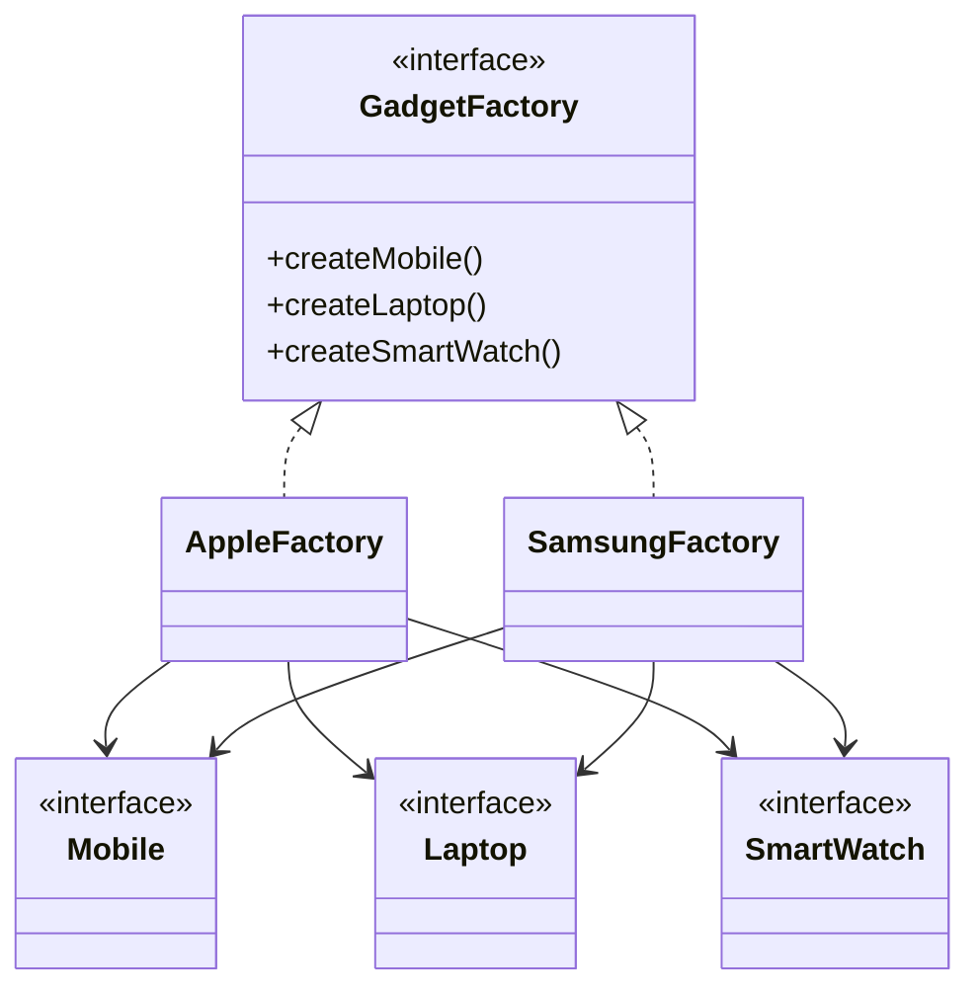

# Abstract Factory Design Pattern

**Category:** Creational Design Pattern
**Difficulty:** ⭐⭐⭐☆☆ (Intermediate)
**Prerequisites:** Interfaces, Inheritance, Polymorphism, Factory Method, OOP Principles
**Used In:** Android, UI Frameworks, Enterprise Applications, Cross-Platform Systems, Product Ecosystems

---

# 1. 📖 Overview

The **Abstract Factory Pattern** is a **Creational Design Pattern** that provides an interface for creating **families of related or dependent objects** without specifying their concrete classes.

Unlike the Factory Method Pattern, which creates a single object, the Abstract Factory Pattern creates a complete family of related products that are designed to work together.

In this project, the pattern is demonstrated using two gadget ecosystems:

- 🍎 Apple
- 📱 Samsung

Each ecosystem consists of compatible products such as Mobile, Laptop, and Smart Watch.

---

# 2. 🎯 Problem Statement

Imagine an e-commerce application that sells gadgets from multiple brands.

Initially, the application supports only Apple products.

```text
Apple Phone
Apple Laptop
Apple Watch
```

Later, Samsung products are introduced.

```text
Samsung Phone
Samsung Laptop
Samsung Watch
```

If the client creates these products directly, it becomes tightly coupled with every brand implementation.

Adding a new brand requires modifying the client code, violating the **Open/Closed Principle**.

---

# 3. 💡 Why this Pattern?

Without Abstract Factory, the client directly creates brand-specific products.

```text
Client
   │
   ├── ApplePhone()
   ├── AppleLaptop()
   ├── AppleWatch()
   ├── SamsungPhone()
   ├── SamsungLaptop()
   └── SamsungWatch()
```

Problems:

- Tight coupling
- Difficult to extend
- Poor maintainability
- Repeated object creation logic

With Abstract Factory, the client communicates only with the factory interface.

```text
                Client
                   │
                   ▼
            GadgetFactory
             /         \
            /           \
     AppleFactory   SamsungFactory
            │             │
            ▼             ▼
     Apple Products  Samsung Products
```

The client remains independent of concrete implementations.

---

# 4. 🏗️ UML Diagram



---

# 5. 👥 Participants

| Participant | Responsibility |
|-------------|----------------|
| **GadgetFactory** | Declares methods for creating a family of products. |
| **AppleFactory** | Creates Apple gadgets. |
| **SamsungFactory** | Creates Samsung gadgets. |
| **Mobile** | Product interface for mobile phones. |
| **Laptop** | Product interface for laptops. |
| **SmartWatch** | Product interface for smart watches. |
| **Client** | Requests products through the factory interface. |

---

# 6. 💻 Implementation Walkthrough

In this project, the **GadgetFactory** interface acts as the Abstract Factory.

It defines methods to create different categories of gadgets.

```kotlin
createMobile()

createLaptop()

createSmartWatch()
```

Two concrete factories implement this interface.

### AppleFactory

Creates

- Apple Mobile
- MacBook
- Apple Watch

### SamsungFactory

Creates

- Samsung Mobile
- Galaxy Book
- Galaxy Watch

The client simply chooses the required factory.

```kotlin
val factory: GadgetFactory = AppleFactory()

val mobile = factory.createMobile()
val laptop = factory.createLaptop()
val watch = factory.createSmartWatch()
```

Notice that the client never creates concrete product classes directly.

This keeps the application loosely coupled and makes it easy to introduce a new brand like Google Pixel or OnePlus without changing the client code.

---

# 7. 🔄 Execution Flow

```text
Application Starts
        │
        ▼
Client Selects Brand
        │
        ▼
Factory Provider
        │
        ▼
AppleFactory / SamsungFactory
        │
        ├──────────────┐
        ▼              ▼
Create Mobile      Create Laptop
        │
        ▼
Create Smart Watch
        │
        ▼
Return Product Family
        │
        ▼
Client Uses Products
```

---

# 8. ✅ Advantages

- Encapsulates object creation.
- Creates compatible product families.
- Promotes loose coupling.
- Easy to add new brands.
- Supports Open/Closed Principle.
- Improves code maintainability.
- Simplifies client code.

---

# 9. ❌ Disadvantages

- Introduces additional interfaces and classes.
- Adding a new product type requires modifying every factory.
- Slightly increases complexity.

Example:

If a new product like **Tablet** is introduced,

every concrete factory must implement

```text
createTablet()
```

---

# 10. ✅ When to Use

Use Abstract Factory when:

- Multiple related objects need to be created together.
- Products belong to the same ecosystem.
- Client should remain independent of concrete classes.
- Application supports multiple brands, themes, or platforms.
- Product compatibility is important.

---

# 11. 🚫 When NOT to Use

Avoid Abstract Factory when:

- Only one product needs to be created.
- Products are completely independent.
- Factory Method is sufficient.
- Object creation logic is simple.

---

# 12. 🌍 Real World Examples

- Apple Ecosystem
- Samsung Ecosystem
- Furniture Manufacturers
- Vehicle Manufacturers
- Cloud Service Providers
- Database Providers

Your implementation perfectly represents a product ecosystem where all gadgets belong to the same brand.

---

# 13. 📱 Android Examples

Common Android examples include:

- Material Design Components
- Material 2 vs Material 3 themes
- ViewModel factories producing related dependencies
- Room database implementations
- Retrofit client configurations
- Cross-platform UI component libraries

---

# 14. 🎤 Interview Questions

### Beginner

- What is the Abstract Factory Pattern?
- What problem does it solve?
- Why is it called a "family of objects"?

### Intermediate

- Difference between Factory Method and Abstract Factory?
- Why does Abstract Factory improve scalability?
- Which SOLID principle does it support?

### Advanced

- How would you add a new brand without changing existing code?
- What happens when a new product category is introduced?
- Can Abstract Factory be combined with Builder or Singleton?

---

# 15. 📖 Key Takeaways

- Abstract Factory is a **Creational Design Pattern**.
- It creates **families of related objects**.
- The client depends only on the abstract factory.
- It promotes loose coupling and improves scalability.
- Your Apple & Samsung Gadget implementation demonstrates how multiple compatible products can be created through a single factory interface without exposing concrete implementations.