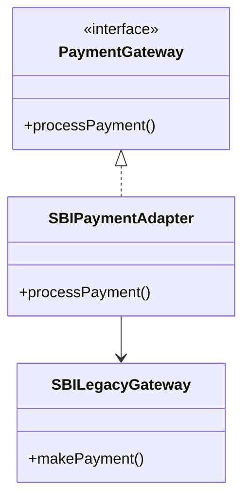

# Adapter Design Pattern

**Category:** Structural Design Pattern
**Difficulty:** ⭐⭐⭐☆☆ (Intermediate)
**Prerequisites:** Interfaces, Inheritance, Composition, Polymorphism, OOP Principles
**Used In:** Android, Payment Gateways, Third-Party SDK Integration, Legacy System Integration, APIs

---

# 1. 📖 Overview

The **Adapter Pattern** is a **Structural Design Pattern** that allows two incompatible interfaces to work together.

It acts as a bridge between an existing class (Adaptee) and the interface expected by the client (Target).

Instead of modifying existing code, the Adapter converts one interface into another, enabling seamless integration between new and legacy systems.

In this project, the Adapter Pattern is demonstrated using a **Legacy SBI Payment Gateway**, allowing it to work with a modern payment processing interface.

---

# 2. 🎯 Problem Statement

Imagine an e-commerce application that supports online payments.

The application is designed to work with a common interface.

```kotlin
PaymentGateway
```

The system already supports modern payment gateways.

Later, the company decides to integrate an old **SBI Legacy Payment System**.

Unfortunately, the SBI gateway exposes a completely different API.

```text
Modern Application

↓

processPayment()

----------------------------

Legacy SBI

↓

makePayment()
```

Because both interfaces are incompatible, the application cannot communicate with the legacy gateway directly.

---

# 3. 💡 Why this Pattern?

Without Adapter

```text
Client

↓

PaymentGateway

❌

SBILegacyGateway
```

Problems

- Incompatible interfaces
- Client modification required
- Tight coupling
- Difficult integration

---

With Adapter

```text
                Client
                   │
                   ▼
          PaymentGateway
                   ▲
                   │
        SBIPaymentAdapter
                   │
                   ▼
         SBILegacyGateway
```

The Adapter translates the modern interface into the legacy interface.

The client remains completely unaware of the legacy implementation.

---

# 4. 🏗️ UML Diagram



---

# 5. 👥 Participants

| Participant | Responsibility |
|-------------|----------------|
| **PaymentGateway** | Defines the interface expected by the client. |
| **SBILegacyGateway** | Existing legacy payment system with an incompatible interface. |
| **SBIPaymentAdapter** | Converts modern payment requests into SBI legacy requests. |
| **Client** | Uses the PaymentGateway interface without knowing about the legacy system. |

---

# 6. 💻 Implementation Walkthrough

In this project, the application communicates only with the **PaymentGateway** interface.

The **SBILegacyGateway** already exists and cannot be modified because it represents a third-party or legacy system.

To bridge the incompatibility, the **SBIPaymentAdapter** implements the `PaymentGateway` interface and internally delegates the request to the legacy gateway.

Example:

```kotlin
val paymentGateway: PaymentGateway =
    SBIPaymentAdapter(SBILegacyGateway())

paymentGateway.processPayment(2500.0)
```

Internally,

```text
processPayment()

↓

makePayment()
```

The Adapter converts the client's request into the format expected by the SBI legacy gateway.

The client never interacts directly with the legacy implementation.

---

# 7. 🔄 Execution Flow

```text
Application Starts

↓

Client Requests Payment

↓

PaymentGateway Interface

↓

SBIPaymentAdapter

↓

SBILegacyGateway

↓

Payment Processed

↓

Success Response Returned
```

---

# 8. ✅ Advantages

- Integrates legacy systems without modifying them.
- Promotes loose coupling.
- Improves code reusability.
- Supports Open/Closed Principle.
- Simplifies third-party SDK integration.
- Allows incompatible interfaces to collaborate.

---

# 9. ❌ Disadvantages

- Introduces an additional layer.
- Slightly increases complexity.
- Too many adapters can make architecture difficult to follow.

---

# 10. ✅ When to Use

Use Adapter when:

- Integrating third-party libraries.
- Working with legacy systems.
- Existing interfaces cannot be modified.
- Migrating from old APIs to new APIs.
- Supporting multiple vendor implementations.

---

# 11. 🚫 When NOT to Use

Avoid Adapter when:

- Interfaces are already compatible.
- You have complete control over both systems.
- The legacy system can be modified directly.
- A simpler abstraction already exists.

---

# 12. 🌍 Real World Examples

- Legacy Banking Systems
- Payment Gateway Integration
- Printer Drivers
- USB-C to HDMI Adapter
- Power Plug Adapters
- Enterprise System Migration
- Cloud Service Integrations

Your SBI Payment Gateway example perfectly represents how enterprises continue using legacy banking systems while exposing modern APIs to new applications.

---

# 13. 📱 Android Examples

The Adapter Pattern is widely used in Android.

Examples include:

- RecyclerView.Adapter
- ListAdapter
- CursorAdapter
- Bluetooth device wrappers
- CameraX compatibility layers
- Legacy SDK wrappers

Another common example is wrapping an old REST SDK inside a modern Repository implementation without changing the rest of the application.

---

# 14. 🎤 Interview Questions

### Beginner

- What is the Adapter Pattern?
- What problem does Adapter solve?
- Why not modify the legacy class directly?

### Intermediate

- Difference between Adapter and Facade?
- Difference between Adapter and Bridge?
- Does Adapter use inheritance or composition?

### Advanced

- How would you adapt multiple legacy systems?
- Can Adapter work with Dependency Injection?
- How would you test an Adapter implementation?

---

# 15. 📖 Key Takeaways

- Adapter is a **Structural Design Pattern**.
- It allows incompatible interfaces to work together.
- It is widely used for integrating legacy systems and third-party libraries.
- It promotes loose coupling without modifying existing code.
- Your SBI Legacy Payment Gateway implementation demonstrates how modern applications can seamlessly integrate legacy systems through an Adapter while keeping the client independent of implementation details.