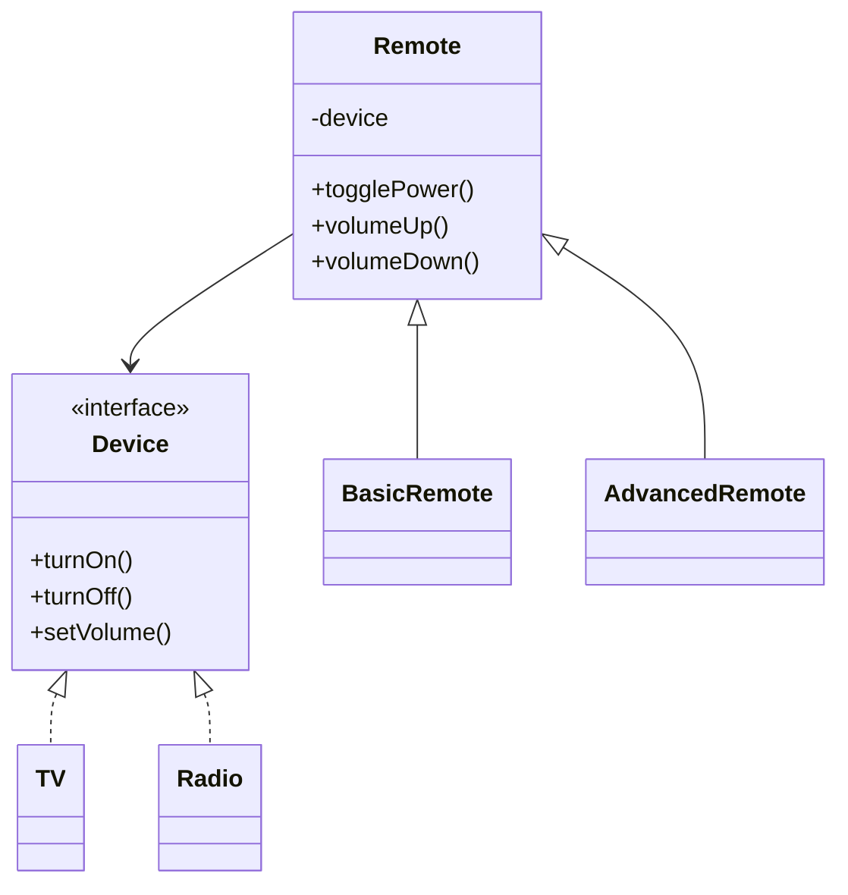

# Bridge Design Pattern

**Category:** Structural Design Pattern
**Difficulty:** ⭐⭐⭐⭐☆ (Intermediate - Advanced)
**Prerequisites:** Interfaces, Composition, Abstraction, Polymorphism, OOP Principles
**Used In:** Android, UI Frameworks, Cross-Platform Development, Device Control Systems

---

# 1. 📖 Overview

The **Bridge Pattern** is a **Structural Design Pattern** that separates an **abstraction** from its **implementation**, allowing both to evolve independently.

Instead of tightly coupling an abstraction with a specific implementation, the Bridge Pattern connects them through composition.

In this project, the pattern is demonstrated using a **Remote Control** (Abstraction) that operates different **Devices** (Implementations) such as TV and Radio.

This allows any remote to control any supported device without modifying existing code.

---

# 2. 🎯 Problem Statement

Imagine a home automation system.

There are multiple devices:

- TV
- Radio

There are also multiple remote controls:

- Basic Remote
- Advanced Remote

Without the Bridge Pattern, separate classes would be required for every combination.

```text
BasicRemoteTV

BasicRemoteRadio

AdvancedRemoteTV

AdvancedRemoteRadio
```

As more remotes and devices are added, the number of classes grows rapidly.

This makes the system difficult to maintain.

---

# 3. 💡 Why this Pattern?

Without Bridge

```text
               Remote

        /               \

BasicRemoteTV      BasicRemoteRadio

AdvancedRemoteTV   AdvancedRemoteRadio
```

Problems

- Too many classes
- Tight coupling
- Difficult to extend
- Code duplication

---

With Bridge

```text
             Remote
                │
                │
          Device Interface
           /            \
         TV            Radio
```

Now

- New Remote → No Device Changes
- New Device → No Remote Changes

Both hierarchies evolve independently.

---

# 4. 🏗️ UML Diagram



---

# 5. 👥 Participants

| Participant | Responsibility |
|-------------|----------------|
| **Device** | Defines operations common to all devices. |
| **TV** | Concrete implementation of Device. |
| **Radio** | Concrete implementation of Device. |
| **Remote** | Abstraction that delegates work to Device. |
| **BasicRemote** | Provides basic remote functionality. |
| **AdvancedRemote** | Extends Remote with additional features. |
| **Client** | Connects a Remote with a Device. |

---

# 6. 💻 Implementation Walkthrough

In this project, **Device** acts as the implementation interface.

Concrete implementations include:

- TV
- Radio

The **Remote** represents the abstraction.

Instead of directly controlling a specific device, the Remote maintains a reference to the Device interface.

Example

```kotlin
val tv = TV()

val remote = BasicRemote(tv)

remote.togglePower()
```

Similarly,

```kotlin
val radio = Radio()

val remote = AdvancedRemote(radio)

remote.togglePower()
```

The Remote delegates all operations to the connected device.

As a result,

- A new device can be added without changing the remote hierarchy.
- A new remote can be introduced without modifying device implementations.

This keeps both hierarchies independent.

---

# 7. 🔄 Execution Flow

```text
Application Starts

↓

Create Device

↓

Create Remote

↓

Connect Remote with Device

↓

Client Calls Remote Operation

↓

Remote Delegates to Device

↓

Device Performs Action

↓

Result Returned
```

---

# 8. ✅ Advantages

- Decouples abstraction from implementation.
- Reduces class explosion.
- Promotes composition over inheritance.
- Easy to introduce new devices.
- Easy to introduce new remotes.
- Supports Open/Closed Principle.
- Improves scalability.

---

# 9. ❌ Disadvantages

- Introduces additional abstractions.
- More interfaces and classes.
- Slightly increases design complexity.

---

# 10. ✅ When to Use

Use Bridge when:

- Two independent hierarchies need to evolve separately.
- Inheritance causes class explosion.
- Composition is preferred over inheritance.
- Different implementations should be interchangeable.

---

# 11. 🚫 When NOT to Use

Avoid Bridge when:

- Only one implementation exists.
- The abstraction is tightly coupled to one implementation.
- Simpler inheritance is sufficient.
- Flexibility is not required.

---

# 12. 🌍 Real World Examples

- TV Remote & Television
- Universal Remote
- Vehicle Dashboard & Engine
- Gaming Controller & Console
- Payment Screen & Payment Provider
- Smart Home Controllers

Your implementation demonstrates how one Remote can operate multiple Devices without depending on concrete implementations.

---

# 13. 📱 Android Examples

Bridge concepts appear in Android in several places:

- Jetpack Compose UI → Android rendering system
- View abstraction → Different rendering implementations
- Bluetooth controller → Different Bluetooth devices
- MediaController → Different MediaSession implementations
- Camera APIs → Different camera hardware implementations

A good Android example is a media controller that works with different playback engines while exposing the same user-facing controls.

---

# 14. 🎤 Interview Questions

### Beginner

- What is the Bridge Pattern?
- Why do we use Bridge?
- What problem does it solve?

### Intermediate

- Difference between Bridge and Adapter?
- Why does Bridge prefer composition over inheritance?
- What are the Abstraction and Implementation in your example?

### Advanced

- How does Bridge prevent class explosion?
- Can Bridge be combined with Abstract Factory?
- How would you implement Bridge using Dependency Injection?

---

# 15. 📖 Key Takeaways

- Bridge is a **Structural Design Pattern**.
- It separates abstraction from implementation.
- Both hierarchies evolve independently.
- It reduces class explosion caused by inheritance.
- Your Remote and Device implementation demonstrates how composition enables flexible communication between abstractions and multiple implementations without creating unnecessary subclasses.