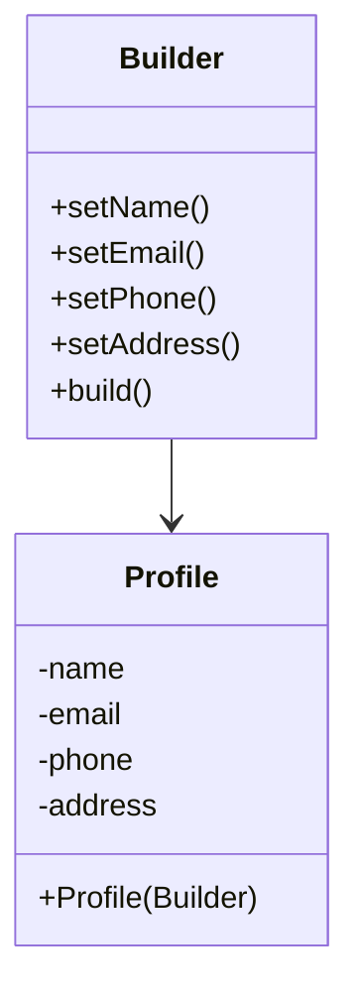

# Builder Design Pattern

**Category:** Creational Design Pattern
**Difficulty:** ⭐⭐⭐☆☆ (Intermediate)
**Prerequisites:** Classes & Objects, Constructors, Method Chaining, Encapsulation, OOP Principles
**Used In:** Android, Spring Boot, Jetpack Compose, Retrofit, Notification APIs, Immutable Objects

---

# 1. 📖 Overview

The **Builder Pattern** is a **Creational Design Pattern** used to construct complex objects step-by-step.

Instead of creating an object using a constructor with numerous parameters, the Builder Pattern separates the construction process from the final object, allowing clients to build objects in a readable and flexible manner.

In this project, the pattern is demonstrated using a **Profile Builder**, where optional user information is configured before creating the final immutable Profile object.

---

# 2. 🎯 Problem Statement

Imagine creating a user profile.

A profile may contain:

- Name
- Email
- Phone Number
- Address
- Date of Birth
- Gender
- Occupation
- Company
- Website
- Bio

Using a constructor would look like:

```kotlin
Profile(
    "Gagan",
    "gagan@gmail.com",
    "9876543210",
    "Bangalore",
    "1992-01-01",
    "Male",
    "Android Developer",
    "Philips",
    "gaganbelgur.com",
    "Software Engineer"
)
```

Problems:

- Difficult to remember parameter order.
- Poor readability.
- Constructor becomes very large.
- Adding new optional fields requires constructor modification.
- Easy to introduce bugs by passing incorrect values.

---

# 3. 💡 Why this Pattern?

Without Builder

```text
Client

↓

Huge Constructor

↓

Complex Object
```

Problems:

- Constructor explosion
- Low readability
- Difficult maintenance

---

With Builder

```text
Client

↓

Profile.Builder()

↓

setName()

↓

setEmail()

↓

setPhone()

↓

build()

↓

Profile
```

Each attribute is configured independently before constructing the final object.

---

# 4. 🏗️ UML Diagram



---

# 5. 👥 Participants

| Participant | Responsibility |
|-------------|----------------|
| **Profile** | Represents the final object being created. |
| **Builder** | Collects all required and optional properties before creating the Profile. |
| **Client** | Configures the Builder and requests the final object using `build()`. |

---

# 6. 💻 Implementation Walkthrough

In this project, the **Profile** object contains multiple optional attributes.

Instead of exposing a large constructor, a dedicated **Builder** class is responsible for configuring each property.

Example:

```kotlin
val profile = Profile.Builder()
    .setName("Gagan Belgur")
    .setEmail("gagan@gmail.com")
    .setPhone("9876543210")
    .setAddress("Bangalore")
    .build()
```

The Builder stores intermediate values while the client configures the object.

Once all required information is provided, calling `build()` creates the final `Profile` object.

This approach keeps object creation readable, maintainable, and scalable.

---

# 7. 🔄 Execution Flow

```text
Application Starts

↓

Create Builder

↓

Configure Properties

↓

setName()

↓

setEmail()

↓

setPhone()

↓

setAddress()

↓

build()

↓

Return Profile Object
```

---

# 8. ✅ Advantages

- Improves code readability.
- Eliminates constructor explosion.
- Supports optional parameters.
- Makes object creation easier.
- Produces immutable objects.
- Simplifies maintenance.
- Easy to extend with new fields.

---

# 9. ❌ Disadvantages

- Introduces an additional Builder class.
- Slightly increases code size.
- Not required for very simple objects.

---

# 10. ✅ When to Use

Use Builder when:

- Objects contain many optional parameters.
- Constructor becomes difficult to understand.
- Readability is important.
- Objects should be immutable after creation.
- Step-by-step construction is required.

---

# 11. 🚫 When NOT to Use

Avoid Builder when:

- Object contains only two or three properties.
- Object creation is straightforward.
- Constructors remain simple.
- No optional attributes exist.

---

# 12. 🌍 Real World Examples

- User Profile Creation
- Pizza Builder
- House Construction
- Vehicle Configuration
- Computer Assembly
- Resume Builder

Your Profile Builder implementation is a practical example where different user details are assembled before creating the final object.

---

# 13. 📱 Android Examples

Builder Pattern is extensively used in Android.

Examples include:

- `NotificationCompat.Builder`
- `AlertDialog.Builder`
- `Retrofit.Builder`
- `OkHttpClient.Builder`
- `Glide.Builder`
- `WorkRequest.Builder`
- `NavDeepLink.Builder`

These APIs allow developers to configure complex objects using method chaining before creating the final instance.

---

# 14. 🎤 Interview Questions

### Beginner

- What problem does the Builder Pattern solve?
- Why not use a constructor with many parameters?
- What is method chaining?

### Intermediate

- Builder vs Factory Method?
- Builder vs Abstract Factory?
- Why is Builder suitable for immutable objects?

### Advanced

- Can Builder validate input before creating an object?
- How would you make a Builder thread-safe?
- Can Builder be combined with Prototype or Singleton?

---

# 15. 📖 Key Takeaways

- Builder is a **Creational Design Pattern**.
- It constructs complex objects step-by-step.
- It improves readability by eliminating constructor explosion.
- It supports optional parameters and immutable objects.
- Your Profile Builder implementation demonstrates how complex user information can be assembled cleanly before creating the final Profile object.