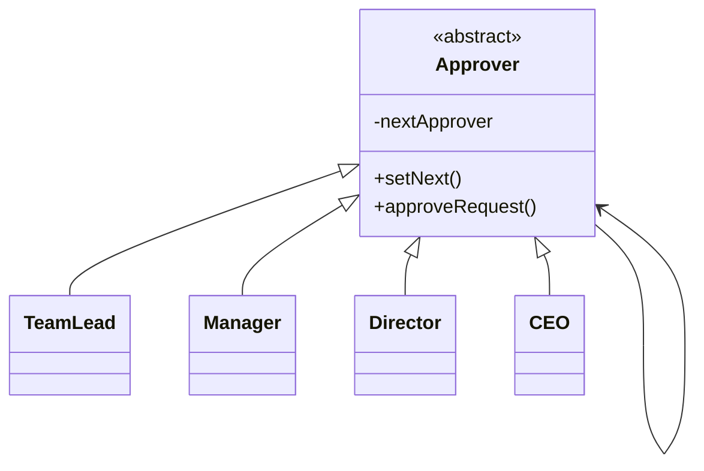

# Chain of Responsibility Design Pattern

**Category:** Behavioral Design Pattern
**Difficulty:** ⭐⭐⭐⭐☆ (Intermediate - Advanced)
**Prerequisites:** Interfaces, Inheritance, Polymorphism, OOP Principles
**Used In:** Android, Spring Boot, Security Filters, Middleware, Request Processing, Approval Workflows

---

# 1. 📖 Overview

The **Chain of Responsibility Pattern** is a **Behavioral Design Pattern** that passes a request through a chain of handlers until one of them processes it.

Instead of the client deciding which object should handle a request, the request is passed from one handler to another until it reaches the appropriate handler.

This reduces coupling between the sender and receiver while making the system flexible and extensible.

In this project, the pattern is demonstrated using an **Expense Approval System**, where approval requests travel through different management levels.

---

# 2. 🎯 Problem Statement

Imagine a company expense approval system.

Employees can submit expense requests.

Depending on the amount, approval is required from different authorities.

Example:

```text
₹2,000

↓

Team Lead

-------------------

₹25,000

↓

Manager

-------------------

₹2,00,000

↓

Director

-------------------

₹10,00,000

↓

CEO
```

Without the Chain of Responsibility Pattern, the client must know exactly who should approve each request.

As approval rules change, the client code becomes increasingly complex.

---

# 3. 💡 Why this Pattern?

Without Chain of Responsibility

```text
Client

↓

if(amount < 5000)

↓

Team Lead

else if(amount < 50000)

↓

Manager

else if(amount < 500000)

↓

Director

else

↓

CEO
```

Problems

- Large if-else chains
- Tight coupling
- Difficult maintenance
- Poor scalability

---

With Chain of Responsibility

```text
Employee

↓

Team Lead

↓

Manager

↓

Director

↓

CEO
```

Each approver decides:

- Approve
- Forward to next handler

The client simply submits the request.

---

# 4. 🏗️ UML Diagram



---

# 5. 👥 Participants

| Participant | Responsibility |
|-------------|----------------|
| **Approver** | Defines the handler interface and maintains the next handler in the chain. |
| **TeamLead** | Handles small expense requests. |
| **Manager** | Handles medium expense requests. |
| **Director** | Handles large expense requests. |
| **CEO** | Handles high-value expense requests. |
| **Client** | Sends the expense request to the first handler in the chain. |

---

# 6. 💻 Implementation Walkthrough

In this project, every approver extends the common `Approver` class.

Each approver knows only:

- Its own approval limit
- The next approver

Example:

```kotlin
teamLead.setNext(manager)
manager.setNext(director)
director.setNext(ceo)
```

The client submits the request only once.

```kotlin
teamLead.approveRequest(expense)
```

If the Team Lead cannot approve the request, it forwards it to the Manager.

The Manager either approves it or forwards it to the Director.

This continues until an appropriate approver processes the request.

The client never interacts directly with the Manager, Director, or CEO.

---

# 7. 🔄 Execution Flow

```text
Application Starts

↓

Create Expense Request

↓

Team Lead

↓

Can Approve?

↓

Yes → Approved

↓

No

↓

Manager

↓

Can Approve?

↓

No

↓

Director

↓

Can Approve?

↓

No

↓

CEO

↓

Approved
```

---

# 8. ✅ Advantages

- Reduces coupling between sender and receiver.
- Eliminates long if-else chains.
- Easy to add new handlers.
- Flexible request processing.
- Supports Open/Closed Principle.
- Improves maintainability.

---

# 9. ❌ Disadvantages

- Request may pass through many handlers.
- Harder to debug long chains.
- No guarantee that a request will be handled.
- Incorrect chain configuration may cause failures.

---

# 10. ✅ When to Use

Use Chain of Responsibility when:

- Multiple objects can handle the same request.
- The handler is determined at runtime.
- Processing should be flexible.
- You want to avoid hardcoded decision logic.

---

# 11. 🚫 When NOT to Use

Avoid Chain of Responsibility when:

- Only one object can ever handle the request.
- The processing sequence is fixed and simple.
- Performance is critical and traversing multiple handlers adds unnecessary overhead.

---

# 12. 🌍 Real World Examples

- Expense Approval Workflow
- Customer Support Escalation
- Loan Approval Systems
- Technical Support Levels
- Email Spam Filters
- Document Approval Process

Your expense approval implementation demonstrates how requests naturally move through an organizational hierarchy until they reach the appropriate authority.

---

# 13. 📱 Android Examples

Chain of Responsibility appears frequently in Android and backend development.

Examples include:

- OkHttp Interceptors
- Android Touch Event Dispatch
- Spring Security Filter Chain
- Servlet Filters
- Middleware Pipelines
- Logging Chains

Example:

```text
Request

↓

Authentication Interceptor

↓

Logging Interceptor

↓

Caching Interceptor

↓

Network Call
```

Each interceptor decides whether to process the request or pass it to the next interceptor.

---

# 14. 🎤 Interview Questions

### Beginner

- What is the Chain of Responsibility Pattern?
- What problem does it solve?
- Why is it called a "chain"?

### Intermediate

- How does it reduce coupling?
- How is it different from the Command Pattern?
- Can multiple handlers process the same request?

### Advanced

- What happens if no handler processes the request?
- How would you dynamically configure the chain?
- How do OkHttp Interceptors implement Chain of Responsibility?

---

# 15. 📖 Key Takeaways

- Chain of Responsibility is a **Behavioral Design Pattern**.
- It passes requests through a chain of handlers.
- Each handler decides whether to process or forward the request.
- It eliminates large conditional statements and improves flexibility.
- Your Expense Approval implementation demonstrates how approval requests can flow through different authority levels while keeping the client independent of individual approvers.