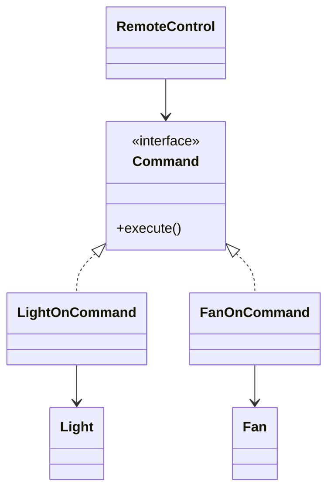

# Command Design Pattern

**Category:** Behavioral Design Pattern
**Difficulty:** ⭐⭐⭐☆☆ (Intermediate)
**Prerequisites:** Interfaces, Composition, Polymorphism, OOP Principles
**Used In:** Android, Smart Home Systems, UI Actions, Undo/Redo, Task Queues, Job Scheduling

---

# 1. 📖 Overview

The **Command Pattern** is a **Behavioral Design Pattern** that encapsulates a request as an object.

Instead of invoking operations directly, the client creates a Command object containing all the information required to perform an action.

This allows requests to be:

- Executed
- Queued
- Logged
- Scheduled
- Undone
- Replayed

In this project, the Command Pattern is demonstrated using a **Smart Home Automation System**, where a Remote Control sends commands to devices such as Lights and Fans.

---

# 2. 🎯 Problem Statement

Imagine a smart home application.

The Remote Control can operate multiple devices:

- Light
- Fan
- Air Conditioner
- Television

Without the Command Pattern, the remote directly interacts with every device.

```text
Remote

↓

Light.turnOn()

↓

Fan.turnOff()

↓

TV.turnOn()
```

As more devices are added, the Remote becomes tightly coupled with every device implementation.

---

# 3. 💡 Why this Pattern?

Without Command

```text
Remote

↓

Light

↓

Fan

↓

TV
```

Problems

- Tight coupling
- Difficult to add new devices
- Remote knows every implementation
- Hard to support undo or scheduling

---

With Command

```text
Remote

↓

Command

↓

Receiver
```

The Remote doesn't know anything about the actual device.

It simply executes a Command.

---

# 4. 🏗️ UML Diagram



---

# 5. 👥 Participants

| Participant | Responsibility |
|-------------|----------------|
| **Command** | Declares the execute operation. |
| **LightOnCommand** | Turns the Light on. |
| **FanOnCommand** | Turns the Fan on. |
| **Light** | Receiver that performs the actual operation. |
| **Fan** | Receiver that performs the actual operation. |
| **RemoteControl** | Invoker that executes commands. |
| **Client** | Creates commands and assigns them to the Remote. |

---

# 6. 💻 Implementation Walkthrough

In this project, every operation is represented by a Command object.

Each Command holds a reference to the device (Receiver).

Example

```kotlin
val light = Light()

val command = LightOnCommand(light)

val remote = RemoteControl()

remote.setCommand(command)

remote.pressButton()
```

When the button is pressed,

the Remote simply calls

```kotlin
command.execute()
```

The Command then delegates the request to the appropriate device.

This keeps the Remote completely independent of Light, Fan, or any future devices.

---

# 7. 🔄 Execution Flow

```text
Application Starts

↓

Create Receiver

↓

Create Command

↓

Assign Command to Remote

↓

User Presses Button

↓

Remote Executes Command

↓

Command Invokes Receiver

↓

Device Performs Action
```

---

# 8. ✅ Advantages

- Decouples sender from receiver.
- Supports undo/redo operations.
- Easy to add new commands.
- Supports scheduling and queuing.
- Enables logging of operations.
- Promotes Open/Closed Principle.

---

# 9. ❌ Disadvantages

- Introduces additional command classes.
- Increases the number of objects.
- Can become verbose for simple actions.

---

# 10. ✅ When to Use

Use Command when:

- Requests should be treated as objects.
- Undo/Redo functionality is required.
- Operations need scheduling.
- Actions need logging.
- Commands should be queued or replayed.

---

# 11. 🚫 When NOT to Use

Avoid Command when:

- Operations are extremely simple.
- Undo functionality is unnecessary.
- Requests never need queuing or scheduling.
- Direct method calls are sufficient.

---

# 12. 🌍 Real World Examples

- Smart Home Remote Controls
- Restaurant Order Systems
- ATM Transactions
- Online Shopping Orders
- Task Scheduling Systems
- Undo/Redo in Editors

Your Smart Home implementation demonstrates how a Remote can execute different device operations without knowing the implementation details of each device.

---

# 13. 📱 Android Examples

The Command Pattern appears frequently in Android.

Examples include:

- Button Click Listeners
- WorkManager Tasks
- PendingIntent
- Menu Actions
- Toolbar Actions
- Undo/Redo Operations in Editors

Example:

```text
User Click

↓

OnClickListener

↓

Business Logic

↓

UI Updated
```

Each click event represents a command that is executed when the user interacts with the UI.

---

# 14. 🎤 Interview Questions

### Beginner

- What is the Command Pattern?
- What problem does it solve?
- Why encapsulate a request as an object?

### Intermediate

- Difference between Command and Strategy?
- How does Command support Undo?
- What is the role of the Invoker?

### Advanced

- How would you implement command history?
- Can multiple commands be executed together?
- How does WorkManager relate to the Command Pattern?

---

# 15. 📖 Key Takeaways

- Command is a **Behavioral Design Pattern**.
- It encapsulates requests as objects.
- It decouples the sender from the receiver.
- It supports queuing, scheduling, logging, and undo operations.
- Your Smart Home implementation demonstrates how a Remote Control can execute different device operations through Command objects without depending on specific device implementations.