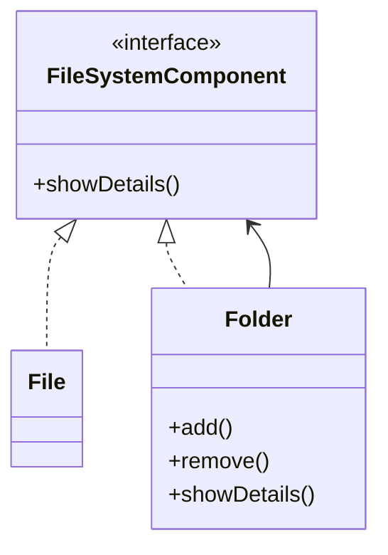

# Composite Design Pattern

**Category:** Structural Design Pattern
**Difficulty:** ⭐⭐⭐☆☆ (Intermediate)
**Prerequisites:** Interfaces, Recursion, Composition, Tree Data Structures, OOP Principles
**Used In:** File Systems, UI Components, Organization Hierarchies, Menu Systems, Android View Hierarchy

---

# 1. 📖 Overview

The **Composite Pattern** is a **Structural Design Pattern** that allows individual objects and groups of objects to be treated uniformly.

It organizes objects into a **tree structure**, where both leaf objects and composite objects implement the same interface.

This enables clients to interact with both individual elements and collections using the same API.

In this project, the Composite Pattern is demonstrated using a **File System**, where both **Files** and **Folders** implement the same interface.

---

# 2. 🎯 Problem Statement

Imagine implementing a File Explorer.

The file system contains:

- Files
- Folders

A folder can contain:

- Files
- Other folders

Example:

```text
Documents
│
├── Resume.pdf
├── Notes.txt
└── Projects
    ├── Android
    └── DesignPatterns
```

Without the Composite Pattern, the client must write separate logic for files and folders.

This makes traversal and operations complicated.

---

# 3. 💡 Why this Pattern?

Without Composite

```text
Client

↓

if(File)

↓

print()

else if(Folder)

↓

iterate children

↓

print()
```

Problems

- Multiple condition checks
- Duplicate traversal logic
- Difficult to extend
- Tight coupling

---

With Composite

```text
                FileSystemComponent
                     ▲
          ┌──────────┴──────────┐
          │                     │
        File                 Folder
```

Now the client simply works with

```text
FileSystemComponent
```

without worrying whether it's a File or Folder.

---

# 4. 🏗️ UML Diagram



---

# 5. 👥 Participants

| Participant | Responsibility |
|-------------|----------------|
| **FileSystemComponent** | Common interface for Files and Folders. |
| **File** | Represents a leaf node. |
| **Folder** | Represents a composite node that can contain multiple FileSystemComponents. |
| **Client** | Interacts with the FileSystemComponent interface without distinguishing between files and folders. |

---

# 6. 💻 Implementation Walkthrough

In this project, both **File** and **Folder** implement the same interface:

```kotlin
FileSystemComponent
```

A **Folder** can contain multiple child components.

Those children may be:

- Files
- Other Folders

Example

```kotlin
val documents = Folder("Documents")

documents.add(File("Resume.pdf"))

documents.add(File("Notes.txt"))

documents.add(projectFolder)
```

When

```kotlin
documents.showDetails()
```

is called, the Folder recursively invokes `showDetails()` on all its children.

The client doesn't need to know whether it's processing a File or Folder.

---

# 7. 🔄 Execution Flow

```text
Application Starts

↓

Create Files

↓

Create Folder

↓

Add Files to Folder

↓

Add Subfolders

↓

Client Calls showDetails()

↓

Folder Traverses Children

↓

Display Complete Hierarchy
```

---

# 8. ✅ Advantages

- Treats individual objects and groups uniformly.
- Simplifies recursive tree traversal.
- Reduces client complexity.
- Promotes recursive composition.
- Easy to extend with new component types.
- Supports Open/Closed Principle.

---

# 9. ❌ Disadvantages

- Can make the design overly generic.
- Difficult to restrict child types.
- Tree traversal may become expensive for very large hierarchies.
- Slightly increases abstraction.

---

# 10. ✅ When to Use

Use Composite when:

- Objects naturally form a tree structure.
- Clients should treat individual and grouped objects uniformly.
- Recursive operations are required.
- Hierarchical relationships exist.

---

# 11. 🚫 When NOT to Use

Avoid Composite when:

- Objects are unrelated.
- Hierarchical structures do not exist.
- Leaf and composite behaviors are completely different.
- Simple collections are sufficient.

---

# 12. 🌍 Real World Examples

Common Composite examples include:

- File Explorer
- Organization Hierarchy
- Folder Structures
- Menu Systems
- HTML DOM Tree
- Family Tree
- Company Departments

Your File & Folder implementation perfectly demonstrates how recursive hierarchies can be modeled using the Composite Pattern.

---

# 13. 📱 Android Examples

Composite concepts are widely used in Android.

Examples include:

- Android View Hierarchy
- ViewGroup → LinearLayout, ConstraintLayout
- RecyclerView with nested adapters
- Jetpack Compose UI Tree
- Navigation Graph
- Menu Hierarchies

Example:

```text
ConstraintLayout

↓

LinearLayout

↓

Button

↓

TextView
```

Every ViewGroup can contain other Views or ViewGroups, just like a Folder contains Files and Folders.

---

# 14. 🎤 Interview Questions

### Beginner

- What is the Composite Pattern?
- What problem does Composite solve?
- What is a Leaf object?

### Intermediate

- Difference between Leaf and Composite?
- Why is recursion important in Composite?
- How does Composite reduce client complexity?

### Advanced

- Can Composite contain another Composite?
- How would you prevent cyclic references?
- How does Android's View hierarchy relate to Composite?

---

# 15. 📖 Key Takeaways

- Composite is a **Structural Design Pattern**.
- It represents hierarchical tree structures.
- It allows clients to treat individual objects and groups uniformly.
- It simplifies recursive operations.
- Your File & Folder implementation demonstrates how a tree structure can be modeled using a common interface, making traversal and management straightforward.