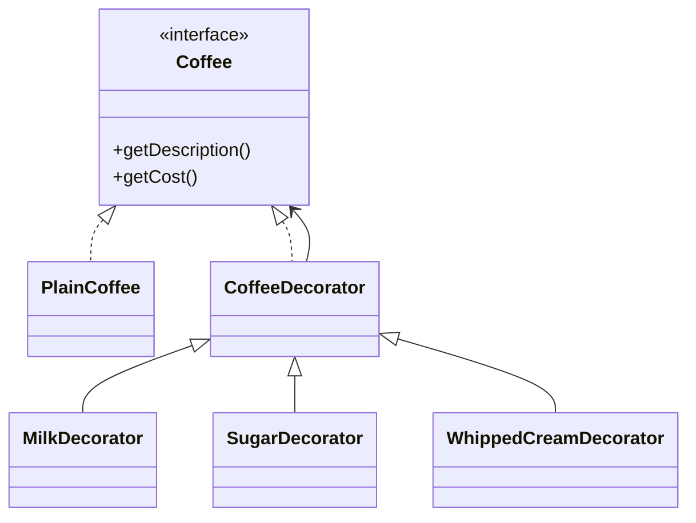

# Decorator Design Pattern

**Category:** Structural Design Pattern
**Difficulty:** ⭐⭐⭐☆☆ (Intermediate)
**Prerequisites:** Interfaces, Composition, Polymorphism, OOP Principles
**Used In:** Android, Java I/O, Jetpack Compose, UI Components, Logging Frameworks

---

# 1. 📖 Overview

The **Decorator Pattern** is a **Structural Design Pattern** that allows behavior or responsibilities to be added to an object dynamically without modifying its original implementation.

Instead of creating multiple subclasses for every possible feature combination, decorators wrap an existing object and extend its functionality.

In this project, the Decorator Pattern is demonstrated using a **Coffee Shop**, where different ingredients such as **Milk**, **Sugar**, and **Whipped Cream** are added to a base coffee.

---

# 2. 🎯 Problem Statement

Imagine a coffee shop.

Customers can order:

- Plain Coffee
- Coffee + Milk
- Coffee + Sugar
- Coffee + Milk + Sugar
- Coffee + Milk + Sugar + Whipped Cream

Without the Decorator Pattern, a new class would be required for every combination.

```text
PlainCoffee

MilkCoffee

SugarCoffee

MilkSugarCoffee

MilkSugarCreamCoffee
```

As more ingredients are introduced, the number of classes grows exponentially.

This becomes difficult to maintain.

---

# 3. 💡 Why this Pattern?

Without Decorator

```text
Coffee

↓

MilkCoffee

↓

MilkSugarCoffee

↓

MilkSugarCreamCoffee
```

Problems

- Too many subclasses
- Code duplication
- Difficult maintenance
- Poor scalability

---

With Decorator

```text
Plain Coffee

↓

Milk Decorator

↓

Sugar Decorator

↓

Whipped Cream Decorator
```

Each decorator wraps the previous object and adds new functionality.

The client can choose any combination at runtime.

---

# 4. 🏗️ UML Diagram



---

# 5. 👥 Participants

| Participant | Responsibility |
|-------------|----------------|
| **Coffee** | Defines the common interface. |
| **PlainCoffee** | Base implementation. |
| **CoffeeDecorator** | Wraps a Coffee object. |
| **MilkDecorator** | Adds milk to coffee. |
| **SugarDecorator** | Adds sugar to coffee. |
| **WhippedCreamDecorator** | Adds whipped cream to coffee. |
| **Client** | Dynamically composes decorators. |

---

# 6. 💻 Implementation Walkthrough

In this project, `Coffee` acts as the common abstraction.

`PlainCoffee` provides the base implementation.

Decorators wrap an existing coffee object.

Example:

```kotlin
var coffee: Coffee = PlainCoffee()

coffee = MilkDecorator(coffee)

coffee = SugarDecorator(coffee)

coffee = WhippedCreamDecorator(coffee)

println(coffee.getDescription())

println(coffee.getCost())
```

Execution Flow

```text
Plain Coffee

↓

Milk

↓

Sugar

↓

Whipped Cream
```

Every decorator delegates the existing behavior to the wrapped object and then adds its own functionality.

No existing class is modified.

---

# 7. 🔄 Execution Flow

```text
Application Starts

↓

Create Plain Coffee

↓

Wrap with Milk Decorator

↓

Wrap with Sugar Decorator

↓

Wrap with Whipped Cream Decorator

↓

Calculate Final Cost

↓

Display Description
```

---

# 8. ✅ Advantages

- Adds behavior dynamically.
- Avoids subclass explosion.
- Promotes composition over inheritance.
- Flexible feature combinations.
- Easy to extend.
- Supports Open/Closed Principle.

---

# 9. ❌ Disadvantages

- Many small decorator classes.
- Debugging becomes slightly harder.
- Object creation chain becomes deeper.
- Execution flow is less obvious.

---

# 10. ✅ When to Use

Use Decorator when:

- Features should be added dynamically.
- Many feature combinations exist.
- Inheritance causes class explosion.
- Existing classes should remain unchanged.

---

# 11. 🚫 When NOT to Use

Avoid Decorator when:

- Objects rarely change behavior.
- Only one variation exists.
- Simpler inheritance is sufficient.
- Dynamic composition is unnecessary.

---

# 12. 🌍 Real World Examples

- Coffee Shop Add-ons
- Pizza Toppings
- Gift Wrapping
- Insurance Add-ons
- Car Accessories
- Hotel Room Services

Your Coffee implementation perfectly demonstrates how additional features can be added dynamically without creating numerous subclasses.

---

# 13. 📱 Android Examples

Decorator is heavily used in Android.

Examples include:

- Jetpack Compose `Modifier`
- Java InputStream / OutputStream
- BufferedInputStream
- BufferedOutputStream
- DataInputStream
- DataOutputStream
- OkHttp Interceptors
- TextView styling

Example:

```kotlin
Modifier
    .padding(16.dp)
    .background(Color.Blue)
    .border(2.dp, Color.Black)
```

Each Modifier decorates the previous Modifier, just like Milk and Sugar decorate the Coffee.

---

# 14. 🎤 Interview Questions

### Beginner

- What is the Decorator Pattern?
- Why do we use Decorator?
- What problem does it solve?

### Intermediate

- Difference between Decorator and Inheritance?
- Difference between Decorator and Composite?
- Why is composition preferred?

### Advanced

- How does Jetpack Compose use Decorator?
- Why are Java I/O Streams considered Decorators?
- Can multiple decorators be applied at runtime?

---

# 15. 📖 Key Takeaways

- Decorator is a **Structural Design Pattern**.
- It adds behavior dynamically without modifying existing classes.
- It uses composition instead of inheritance.
- It avoids subclass explosion.
- Your Coffee Shop implementation demonstrates how multiple features can be combined at runtime by wrapping objects with decorators, resulting in a flexible and maintainable design.