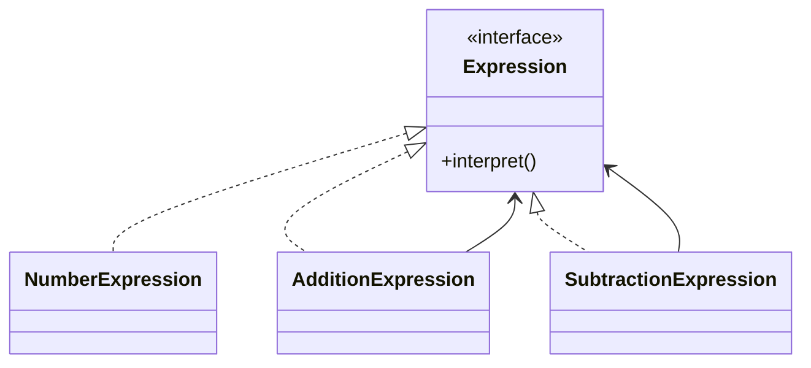

# Interpreter Design Pattern

**Category:** Behavioral Design Pattern
**Difficulty:** ⭐⭐⭐⭐⭐ (Advanced)
**Prerequisites:** Recursion, Trees, Interfaces, Polymorphism, OOP Principles, Basic Parsing Concepts
**Used In:** Compilers, SQL Parsers, Rule Engines, Expression Evaluators, Search Filters, DSLs (Domain Specific Languages)

---

# 1. 📖 Overview

The **Interpreter Pattern** is a **Behavioral Design Pattern** that defines the grammar of a language and provides an interpreter to evaluate expressions written in that language.

Instead of handling every possible expression using large conditional statements, each grammar rule is represented as an object.

Complex expressions are built by combining simpler expressions into a tree structure.

In this project, the pattern is demonstrated using an **Arithmetic Expression Interpreter**, where mathematical expressions such as **10 + 20 - 5** are evaluated using expression objects.

---

# 2. 🎯 Problem Statement

Imagine building a simple calculator.

Users enter expressions like:

```text
10 + 20

15 - 5

30 + 10 - 8
```

Without the Interpreter Pattern, every operator must be handled manually.

```text
if(operator == "+")

else if(operator == "-")

else if(operator == "*")

else if(operator == "/")
```

As the grammar grows, the code becomes increasingly complex and difficult to maintain.

---

# 3. 💡 Why this Pattern?

Without Interpreter

```text
Calculator

↓

if(+)

↓

if(-)

↓

if(*)

↓

if(/)
```

Problems

- Large conditional statements
- Difficult to extend
- Poor maintainability
- Grammar scattered across the codebase

---

With Interpreter

```text
Expression

↓

Number

Addition

Subtraction

↓

Interpret Result
```

Each expression knows how to interpret itself.

Complex expressions are built by combining smaller expressions.

---

# 4. 🏗️ UML Diagram



---

# 5. 👥 Participants

| Participant | Responsibility |
|-------------|----------------|
| **Expression** | Declares the interpret operation. |
| **NumberExpression** | Represents terminal expressions (numbers). |
| **AdditionExpression** | Represents addition between two expressions. |
| **SubtractionExpression** | Represents subtraction between two expressions. |
| **Client** | Builds the expression tree and starts interpretation. |

---

# 6. 💻 Implementation Walkthrough

In this project, every expression implements the `Expression` interface.

Terminal expressions represent numbers.

```kotlin
NumberExpression(10)

NumberExpression(20)
```

Non-terminal expressions combine other expressions.

Example:

```kotlin
val expression = SubtractionExpression(
    AdditionExpression(
        NumberExpression(10),
        NumberExpression(20)
    ),
    NumberExpression(5)
)

println(expression.interpret())
```

Execution Flow

```text
10 + 20

↓

30

↓

30 - 5

↓

25
```

Each expression evaluates itself recursively.

The client simply builds the expression tree and invokes `interpret()`.

---

# 7. 🔄 Execution Flow

```text
Application Starts

↓

Create Number Expressions

↓

Create Operator Expressions

↓

Build Expression Tree

↓

Call interpret()

↓

Evaluate Child Expressions

↓

Return Final Result
```

---

# 8. ✅ Advantages

- Encapsulates grammar rules into separate classes.
- Easy to introduce new expression types.
- Improves readability of expression evaluation.
- Supports recursive evaluation.
- Promotes Open/Closed Principle.
- Well suited for simple languages and DSLs.

---

# 9. ❌ Disadvantages

- Creates many small classes.
- Complex grammars become difficult to maintain.
- Performance may degrade for large expression trees.
- Not suitable for full programming languages.

---

# 10. ✅ When to Use

Use Interpreter when:

- A language or grammar needs to be evaluated.
- Expressions follow well-defined rules.
- Business rules should be represented as objects.
- Recursive expression evaluation is required.
- Building a small DSL.

---

# 11. 🚫 When NOT to Use

Avoid Interpreter when:

- The grammar is very large.
- Performance is critical.
- A mature parser already exists.
- Implementing a complete programming language.

For large languages, parser generators such as ANTLR are generally a better choice.

---

# 12. 🌍 Real World Examples

Common examples include:

- SQL Query Parsing
- Mathematical Expression Evaluation
- Search Filters
- Business Rule Engines
- Regular Expression Engines
- Spreadsheet Formula Evaluation
- Domain Specific Languages (DSLs)

Your Arithmetic Expression implementation demonstrates how complex expressions can be represented as a tree of expression objects and evaluated recursively.

---

# 13. 📱 Android Examples

Interpreter is less common in Android UI development but appears in infrastructure and tooling.

Examples include:

- Room SQL Parsing
- Navigation Deep Link Matching
- Search Filter Builders
- Android Lint Rules
- Expression-based Rule Engines
- JSONPath Processing

Example:

```text
price > 1000

AND

rating >= 4
```

can be represented as

```text
PriceExpression

↓

AndExpression

↓

RatingExpression
```

Each expression evaluates a portion of the rule, and the final result is computed recursively.

---

# 14. 🎤 Interview Questions

### Beginner

- What is the Interpreter Pattern?
- What problem does it solve?
- What is an expression tree?

### Intermediate

- Difference between Terminal and Non-Terminal expressions?
- What is recursive interpretation?
- When should Interpreter be used?

### Advanced

- Why is Interpreter rarely used in enterprise applications?
- Difference between Interpreter and Compiler?
- Why are parser generators preferred for large grammars?

---

# 15. 📖 Key Takeaways

- Interpreter is a **Behavioral Design Pattern**.
- It defines a grammar and evaluates expressions based on that grammar.
- It represents expressions as an object tree.
- It recursively interprets terminal and non-terminal expressions.
- Your Arithmetic Expression implementation demonstrates how mathematical expressions can be modeled using expression objects, making it easy to extend the grammar while keeping interpretation logic organized and maintainable.