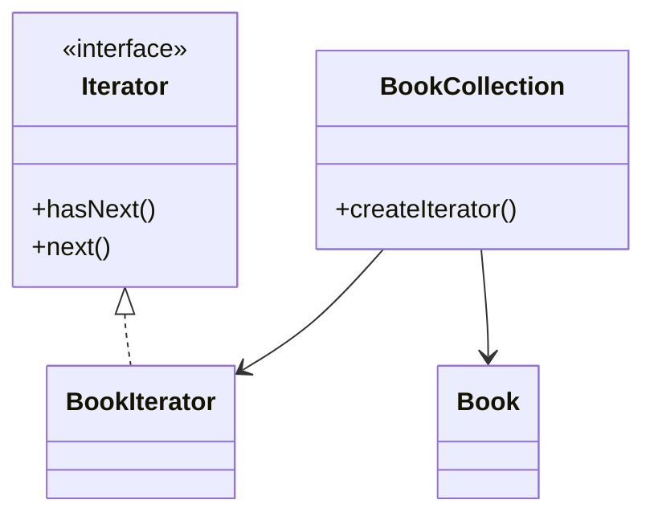

# Iterator Design Pattern

**Category:** Behavioral Design Pattern
**Difficulty:** ⭐⭐☆☆☆ (Beginner - Intermediate)
**Prerequisites:** Collections, Interfaces, Encapsulation, OOP Principles
**Used In:** Java Collections Framework, Android Collections, Database Cursors, File Systems, Pagination APIs

---

# 1. 📖 Overview

The **Iterator Pattern** is a **Behavioral Design Pattern** that provides a way to access the elements of a collection sequentially **without exposing its internal representation**.

Instead of allowing clients to directly access the underlying data structure, the Iterator Pattern delegates traversal responsibility to a dedicated Iterator object.

In this project, the pattern is demonstrated using a **Book Collection**, where books are accessed one by one through an Iterator.

---

# 2. 🎯 Problem Statement

Imagine a library application.

It contains a collection of books.

```text
Book 1

Book 2

Book 3

Book 4

Book 5
```

Without an Iterator, the client directly accesses the collection.

```kotlin
books[0]

books[1]

books[2]
```

If the collection changes from an ArrayList to a LinkedList or another data structure, the client code may also need to change.

---

# 3. 💡 Why this Pattern?

Without Iterator

```text
Client

↓

ArrayList

↓

Index Access
```

Problems

- Client depends on internal collection structure.
- Traversal logic is duplicated.
- Difficult to change collection implementation.
- Violates encapsulation.

---

With Iterator

```text
Client

↓

Iterator

↓

Book Collection
```

The client simply asks the Iterator for the next element.

It doesn't know how the collection is stored.

---

# 4. 🏗️ UML Diagram



---

# 5. 👥 Participants

| Participant | Responsibility |
|-------------|----------------|
| **Iterator** | Defines traversal operations. |
| **BookIterator** | Traverses the BookCollection. |
| **BookCollection** | Stores books and creates an Iterator. |
| **Book** | Represents an individual book. |
| **Client** | Uses the Iterator to access books sequentially. |

---

# 6. 💻 Implementation Walkthrough

In this project, `BookCollection` stores all books.

Instead of exposing the internal list, it provides an Iterator.

Example

```kotlin
val iterator = bookCollection.createIterator()

while(iterator.hasNext()){

    println(iterator.next())
}
```

The client never interacts with the underlying collection directly.

Whether books are stored in an ArrayList, LinkedList, or another structure is completely hidden from the client.

This keeps traversal logic separate from collection management.

---

# 7. 🔄 Execution Flow

```text
Application Starts

↓

Create Book Collection

↓

Add Books

↓

Create Iterator

↓

hasNext()

↓

next()

↓

Display Book

↓

Repeat Until End
```

---

# 8. ✅ Advantages

- Hides internal collection implementation.
- Simplifies collection traversal.
- Supports multiple traversal strategies.
- Improves encapsulation.
- Makes client code cleaner.
- Supports Open/Closed Principle.

---

# 9. ❌ Disadvantages

- Introduces additional Iterator classes.
- Slightly increases complexity.
- May be unnecessary for very small collections.

---

# 10. ✅ When to Use

Use Iterator when:

- Collections should hide their internal structure.
- Multiple traversal strategies are required.
- Traversal logic should be separated from the collection.
- Clients should not depend on collection implementation.

---

# 11. 🚫 When NOT to Use

Avoid Iterator when:

- Collections are extremely simple.
- Direct iteration is sufficient.
- Additional abstraction adds unnecessary complexity.

---

# 12. 🌍 Real World Examples

- Library Management Systems
- Music Playlists
- File Explorer
- Browser History
- Contact Lists
- Shopping Cart Items

Your Book Collection implementation demonstrates how a client can traverse books without knowing how they are internally stored.

---

# 13. 📱 Android Examples

Iterator concepts are widely used in Android and Java.

Examples include:

- Java Collections (`Iterator`)
- Kotlin Collections
- RecyclerView Adapter data iteration
- Cursor API
- Paging Library
- Sequence API

Example:

```kotlin
val iterator = books.iterator()

while(iterator.hasNext()){

    println(iterator.next())
}
```

The collection controls traversal while hiding its internal implementation.

---

# 14. 🎤 Interview Questions

### Beginner

- What is the Iterator Pattern?
- What problem does Iterator solve?
- Why shouldn't clients access collections directly?

### Intermediate

- Difference between Iterator and `forEach`?
- How does Iterator improve encapsulation?
- Can multiple iterators traverse the same collection independently?

### Advanced

- How would you implement a reverse iterator?
- How does Kotlin's Iterator work internally?
- What is the relationship between Iterator and Java Collections?

---

# 15. 📖 Key Takeaways

- Iterator is a **Behavioral Design Pattern**.
- It provides sequential access to collection elements.
- It hides the internal representation of collections.
- It separates traversal logic from collection management.
- Your Book Collection implementation demonstrates how clients can iterate through a collection using a dedicated Iterator without depending on the underlying data structure.