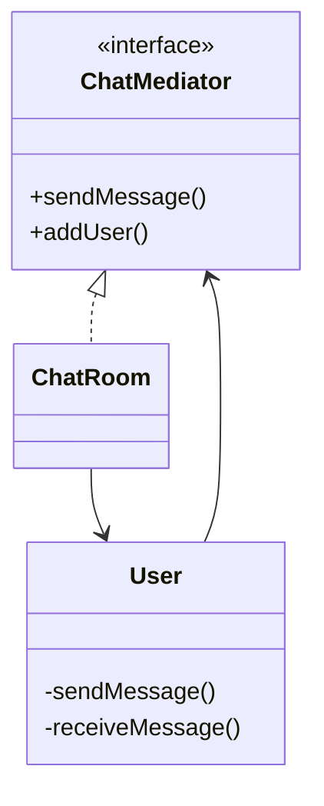

# Mediator Design Pattern

**Category:** Behavioral Design Pattern
**Difficulty:** ⭐⭐⭐⭐☆ (Intermediate -Advanced)
**Prerequisites:** Interfaces, Composition, Object Collaboration, OOP Principles
**Used In:** Chat Applications, Air Traffic Control, Smart Home Systems, GUI Frameworks, Event Management

---

# 1. 📖 Overview

The **Mediator Pattern** is a **Behavioral Design Pattern** that centralizes communication between multiple objects.

Instead of objects communicating directly with each other, they communicate through a **Mediator**, which coordinates all interactions.

This reduces coupling between objects and makes communication easier to manage.

In this project, the pattern is demonstrated using a **Chat Room**, where users communicate through a central ChatRoom instead of sending messages directly to each other.

---

# 2. 🎯 Problem Statement

Imagine building a group chat application.

Users include:

- Alice
- Bob
- Charlie
- David

Without a Mediator, every user must know about every other user.

```text
Alice ↔ Bob

Alice ↔ Charlie

Alice ↔ David

Bob ↔ Charlie

Bob ↔ David

Charlie ↔ David
```

As more users join, communication becomes increasingly complex.

The number of relationships grows rapidly, making the system difficult to maintain.

---

# 3. 💡 Why this Pattern?

Without Mediator

```text
Alice

↕ ↕ ↕

Bob Charlie David
```

Problems

- Tight coupling
- Every object knows every other object
- Difficult to add new participants
- Complex communication logic

---

With Mediator

```text
          Alice
             │
             │
Bob ─── ChatRoom ─── Charlie
             │
             │
          David
```

Every user communicates only with the ChatRoom.

The ChatRoom decides who receives each message.

---

# 4. 🏗️ UML Diagram



---

# 5. 👥 Participants

| Participant | Responsibility |
|-------------|----------------|
| **ChatMediator** | Defines communication between users. |
| **ChatRoom** | Coordinates message delivery. |
| **User** | Sends and receives messages through the ChatRoom. |
| **Client** | Creates users and registers them with the ChatRoom. |

---

# 6. 💻 Implementation Walkthrough

In this project, every user communicates through a **ChatRoom**.

Users never send messages directly to each other.

Example

```kotlin
val mediator = ChatRoom()

val alice = User("Alice", mediator)

val bob = User("Bob", mediator)

mediator.addUser(alice)

mediator.addUser(bob)
```

When Alice sends a message,

```kotlin
alice.sendMessage("Hello Everyone")
```

the message is sent to the ChatRoom.

The ChatRoom then distributes the message to every registered user except the sender.

The sender does not need to know who is online or how many users exist.

---

# 7. 🔄 Execution Flow

```text
Application Starts

↓

Create ChatRoom

↓

Create Users

↓

Register Users

↓

User Sends Message

↓

ChatRoom Receives Message

↓

ChatRoom Finds Recipients

↓

Recipients Receive Message
```

---

# 8. ✅ Advantages

- Reduces coupling between objects.
- Centralizes communication logic.
- Simplifies object interactions.
- Easy to add new participants.
- Promotes Open/Closed Principle.
- Improves maintainability.

---

# 9. ❌ Disadvantages

- Mediator can become very large.
- Centralized logic may become difficult to maintain.
- Adds another abstraction layer.
- Poor design can turn the Mediator into a "God Object."

---

# 10. ✅ When to Use

Use Mediator when:

- Many objects communicate with each other.
- Communication logic is becoming complex.
- Objects should remain independent.
- Centralized coordination is preferred.

---

# 11. 🚫 When NOT to Use

Avoid Mediator when:

- Only two objects communicate.
- Communication is straightforward.
- Centralized coordination is unnecessary.
- The additional abstraction adds little value.

---

# 12. 🌍 Real World Examples

Common examples include:

- WhatsApp Groups
- Slack Channels
- Microsoft Teams
- Air Traffic Control
- Smart Home Hub
- Stock Exchange
- Auction Systems

Your Chat Room implementation clearly demonstrates how users communicate through a central mediator rather than directly with one another.

---

# 13. 📱 Android Examples

Mediator concepts appear in Android and enterprise applications.

Examples include:

- LiveData
- EventBus
- RxJava Subjects
- Kotlin SharedFlow
- Navigation Component
- BroadcastReceiver

Example:

```text
UI

↓

ViewModel

↓

LiveData

↓

Observers
```

The ViewModel publishes updates through LiveData, which acts as a mediator between the data source and multiple UI observers.

---

# 14. 🎤 Interview Questions

### Beginner

- What is the Mediator Pattern?
- What problem does it solve?
- Why not let objects communicate directly?

### Intermediate

- Difference between Mediator and Observer?
- How does Mediator reduce coupling?
- What are the responsibilities of the Mediator?

### Advanced

- What are the drawbacks of a large Mediator?
- Can multiple Mediators exist?
- How do chat applications implement the Mediator Pattern?

---

# 15. 📖 Key Takeaways

- Mediator is a **Behavioral Design Pattern**.
- It centralizes communication between objects.
- Objects communicate through a Mediator instead of directly.
- It reduces coupling and simplifies collaboration.
- Your Chat Room implementation demonstrates how multiple users can exchange messages efficiently through a central ChatRoom, keeping users independent of one another.