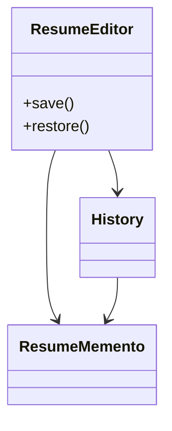

# Memento Design Pattern

**Category:** Behavioral Design Pattern
**Difficulty:** ⭐⭐⭐⭐☆ (Intermediate - Advanced)
**Prerequisites:** Classes & Objects, Encapsulation, Object State, OOP Principles
**Used In:** Text Editors, IDEs, Games, Version Control, Android Applications, Undo/Redo Systems

---

# 1. 📖 Overview

The **Memento Pattern** is a **Behavioral Design Pattern** that captures and stores an object's internal state without exposing its implementation details.

Later, the stored state can be restored, allowing the object to return to a previous state.

This pattern is commonly used to implement:

- Undo
- Redo
- Checkpoints
- Save & Restore
- Version History

In this project, the pattern is demonstrated using a **Resume Editor**, where users can save different versions of a resume and restore any previous version whenever required.

---

# 2. 🎯 Problem Statement

Imagine editing a resume.

A user continuously updates:

- Name
- Education
- Experience
- Skills

Example

```text
Version 1

Name
Education

--------------------

Version 2

Name
Education
Experience

--------------------

Version 3

Name
Education
Experience
Skills
```

If the user accidentally removes important information, there should be a way to restore an earlier version.

Without saving previous states, recovery becomes impossible.

---

# 3. 💡 Why this Pattern?

Without Memento

```text
Resume Editor

↓

Modify Resume

↓

Old State Lost
```

Problems

- No Undo
- No History
- Difficult Recovery
- Data Loss

---

With Memento

```text
Resume Editor

↓

Save State

↓

Caretaker

↓

Restore Previous Version
```

Every important change is stored before modification.

Any previous version can later be restored.

---

# 4. 🏗️ UML Diagram



---

# 5. 👥 Participants

| Participant | Responsibility |
|-------------|----------------|
| **ResumeEditor (Originator)** | Creates and restores resume snapshots. |
| **ResumeMemento** | Stores a snapshot of the ResumeEditor's state. |
| **History (Caretaker)** | Maintains the list of saved resume versions. |
| **Client** | Saves and restores resume versions. |

---

# 6. 💻 Implementation Walkthrough

In this project, the **ResumeEditor** acts as the Originator.

Whenever the user wants to preserve the current state,

the editor creates a new Memento.

Example

```kotlin
history.save(resumeEditor.save())
```

The user continues editing.

Later,

```kotlin
resumeEditor.restore(history.undo())
```

The ResumeEditor restores all fields from the selected Memento.

The Caretaker never modifies the stored state.

It only stores and returns snapshots.

This keeps encapsulation intact.

---

# 7. 🔄 Execution Flow

```text
Application Starts

↓

Create Resume

↓

User Updates Resume

↓

Save Snapshot

↓

History Stores Snapshot

↓

User Continues Editing

↓

Undo Requested

↓

Retrieve Previous Snapshot

↓

Restore Resume
```

---

# 8. ✅ Advantages

- Supports Undo and Redo.
- Preserves encapsulation.
- Maintains version history.
- Easy state restoration.
- Simplifies rollback operations.
- Improves user experience.

---

# 9. ❌ Disadvantages

- Can consume significant memory if many snapshots are stored.
- Managing snapshot history adds complexity.
- Large object graphs make snapshots expensive.
- Requires careful cleanup of old snapshots.

---

# 10. ✅ When to Use

Use Memento when:

- Undo/Redo functionality is required.
- Previous object states must be restored.
- Version history is important.
- Object state should remain encapsulated.
- Checkpoint functionality is needed.

---

# 11. 🚫 When NOT to Use

Avoid Memento when:

- Object state is very small and recreation is trivial.
- History is never required.
- Memory usage is a major concern.
- State changes are infrequent.

---

# 12. 🌍 Real World Examples

Common examples include:

- Microsoft Word Undo
- Photoshop History
- IntelliJ / Android Studio Undo
- Resume Editors
- Video Game Save Points
- Version Control Systems

Your Resume Editor implementation clearly demonstrates how multiple resume versions can be stored and restored without exposing internal object details.

---

# 13. 📱 Android Examples

Memento concepts are widely used in Android.

Examples include:

- Undo in Note Applications
- Drawing Apps
- Form State Restoration
- Navigation Back Stack
- SavedStateHandle
- ViewModel State Restoration

Example:

```text
User Types

↓

Save Snapshot

↓

Undo

↓

Restore Previous Text
```

Another practical example is restoring screen state after configuration changes using `SavedStateHandle`.

---

# 14. 🎤 Interview Questions

### Beginner

- What is the Memento Pattern?
- What problem does it solve?
- What is a Memento?

### Intermediate

- What are the roles of Originator, Memento, and Caretaker?
- Why does Memento preserve encapsulation?
- How does Memento implement Undo?

### Advanced

- How would you optimize memory when storing many snapshots?
- Difference between Memento and Prototype?
- How would you implement Redo in addition to Undo?

---

# 15. 📖 Key Takeaways

- Memento is a **Behavioral Design Pattern**.
- It captures and restores an object's state without exposing internal details.
- It is ideal for implementing Undo, Redo, and version history.
- It preserves encapsulation while enabling state restoration.
- Your Resume Editor implementation demonstrates how snapshots of a resume can be saved and restored efficiently, allowing users to recover previous versions without directly manipulating the editor's internal state.