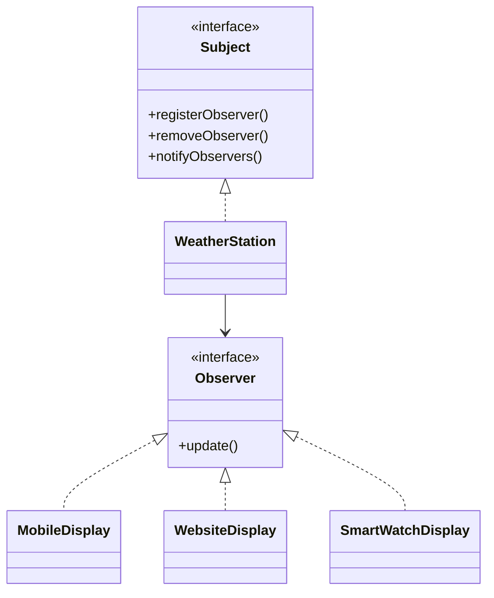

# Observer Design Pattern

**Category:** Behavioral Design Pattern
**Difficulty:** ⭐⭐⭐☆☆ (Intermediate)
**Prerequisites:** Interfaces, Collections, Object Collaboration, OOP Principles
**Used In:** Android, Event Systems, Weather Applications, Notification Systems, Stock Market Apps

---

# 1. 📖 Overview

The **Observer Pattern** is a **Behavioral Design Pattern** that defines a **one-to-many dependency** between objects.

When the state of one object changes (Subject), all its dependent objects (Observers) are automatically notified and updated.

Instead of constantly checking for changes (polling), observers subscribe to the subject and receive updates whenever the subject's state changes.

In this project, the pattern is demonstrated using a **Weather Station**, where multiple display devices automatically receive weather updates whenever the temperature changes.

---

# 2. 🎯 Problem Statement

Imagine a weather monitoring system.

Multiple devices need weather updates.

- Mobile App
- LED Display
- Website Dashboard
- Smart Watch

Whenever the weather changes, every display must be updated.

Without the Observer Pattern, the Weather Station would need to manually update every display.

```text
Weather Station

↓

Update Mobile

↓

Update Website

↓

Update Smart Watch

↓

Update LED Display
```

Adding a new display requires modifying the Weather Station.

---

# 3. 💡 Why this Pattern?

Without Observer

```text
Weather Station

↓

Mobile

↓

Website

↓

Smart Watch

↓

LED Display
```

Problems

- Tight coupling
- Difficult to add new displays
- Subject knows every observer
- Poor scalability

---

With Observer

```text
          Observer

         ▲    ▲    ▲

         │    │    │

Mobile  Watch Website

         ▲

         │

    Weather Station
```

Observers register themselves.

Whenever the Weather Station updates, every registered observer receives the notification automatically.

---

# 4. 🏗️ UML Diagram



---

# 5. 👥 Participants

| Participant | Responsibility |
|-------------|----------------|
| **Subject** | Maintains the list of observers and notifies them. |
| **WeatherStation** | Concrete subject that publishes weather updates. |
| **Observer** | Defines the update method. |
| **MobileDisplay** | Receives weather updates. |
| **WebsiteDisplay** | Displays updated weather information. |
| **SmartWatchDisplay** | Shows notifications on the smartwatch. |
| **Client** | Registers observers with the Weather Station. |

---

# 6. 💻 Implementation Walkthrough

In this project, the **WeatherStation** maintains a list of registered observers.

Example

```kotlin
weatherStation.registerObserver(mobileDisplay)

weatherStation.registerObserver(websiteDisplay)

weatherStation.registerObserver(smartWatch)
```

Whenever the weather changes,

```kotlin
weatherStation.setTemperature(30)
```

the WeatherStation automatically calls

```kotlin
notifyObservers()
```

Each observer receives the latest weather information by implementing

```kotlin
update()
```

The WeatherStation does not know how each display presents the data.

It simply broadcasts the update.

---

# 7. 🔄 Execution Flow

```text
Application Starts

↓

Create Weather Station

↓

Create Displays

↓

Register Observers

↓

Weather Changes

↓

Notify Observers

↓

Each Display Updates Automatically
```

---

# 8. ✅ Advantages

- Loose coupling between Subject and Observers.
- Easy to add new observers.
- Supports dynamic subscription.
- Improves scalability.
- Promotes Open/Closed Principle.
- Event-driven communication.

---

# 9. ❌ Disadvantages

- Notification order may not be guaranteed.
- Too many observers may impact performance.
- Difficult to debug event chains.
- Observers must be removed properly to avoid memory leaks.

---

# 10. ✅ When to Use

Use Observer when:

- Multiple objects depend on another object's state.
- Automatic notifications are required.
- Event-driven communication is needed.
- Subscribers should be added or removed dynamically.

---

# 11. 🚫 When NOT to Use

Avoid Observer when:

- Only one object needs updates.
- Notifications are infrequent.
- Tight synchronization is required.
- Direct communication is simpler.

---

# 12. 🌍 Real World Examples

Common Observer examples include:

- Weather Applications
- YouTube Subscribers
- Stock Market Updates
- News Notifications
- Email Subscriptions
- Social Media Followers
- Cricket Score Updates

Your Weather Station implementation clearly demonstrates how one publisher can notify multiple subscribers whenever new information becomes available.

---

# 13. 📱 Android Examples

Observer is one of the most commonly used patterns in Android.

Examples include:

- LiveData
- StateFlow
- SharedFlow
- RxJava Observable
- Firebase Realtime Database Listeners
- BroadcastReceiver
- EventBus

Example:

```text
Repository

↓

LiveData

↓

Activity

Fragment

Compose UI
```

Whenever LiveData changes, every observer automatically receives the latest value.

---

# 14. 🎤 Interview Questions

### Beginner

- What is the Observer Pattern?
- What problem does it solve?
- What is the difference between Subject and Observer?

### Intermediate

- How does Observer reduce coupling?
- Difference between Observer and Mediator?
- What happens when an Observer is removed?

### Advanced

- How does LiveData implement Observer?
- How does StateFlow relate to Observer?
- How do you prevent memory leaks in Observer implementations?

---

# 15. 📖 Key Takeaways

- Observer is a **Behavioral Design Pattern**.
- It establishes a one-to-many relationship between objects.
- Observers automatically receive updates when the Subject changes.
- It promotes loose coupling and event-driven communication.
- Your Weather Station implementation demonstrates how multiple display devices can stay synchronized with changing weather conditions without being tightly coupled to the Weather Station.