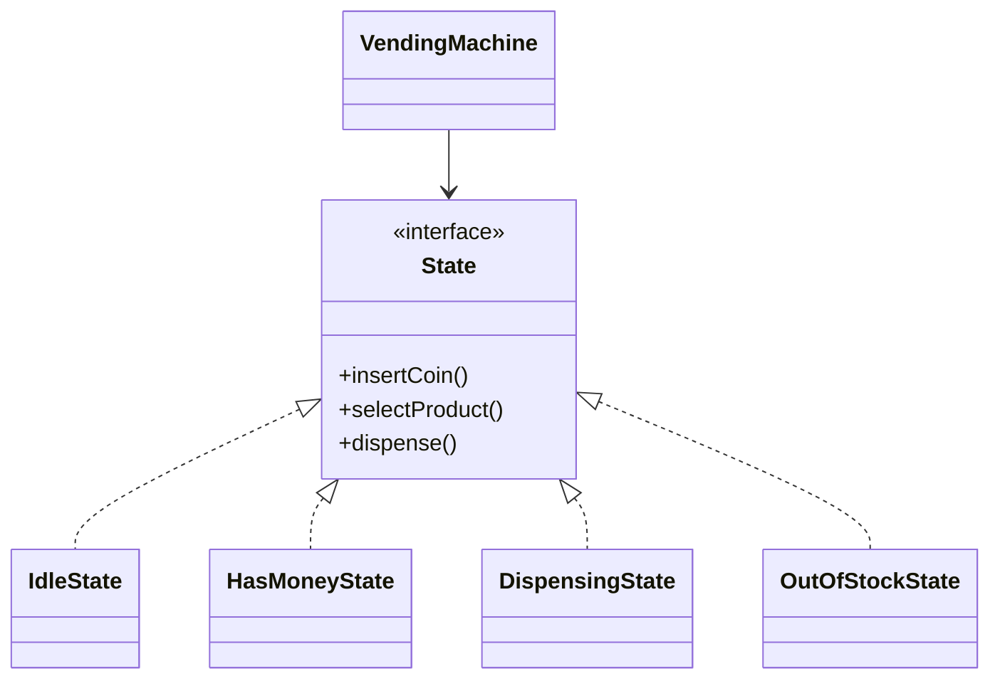

# State Design Pattern

**Category:** Behavioral Design Pattern
**Difficulty:** ⭐⭐⭐⭐☆ (Intermediate - Advanced)
**Prerequisites:** Interfaces, Polymorphism, Composition, OOP Principles, State Management
**Used In:** Android, Workflow Systems, Media Players, Vending Machines, UI Navigation, Games

---

# 1. 📖 Overview

The **State Pattern** is a **Behavioral Design Pattern** that allows an object to change its behavior when its internal state changes.

Instead of using large conditional statements to determine behavior, the State Pattern delegates state-specific behavior to separate State objects.

As the object's state changes, its behavior changes automatically without modifying the client.

In this project, the pattern is demonstrated using a **Vending Machine**, where operations such as inserting money, selecting a product, and dispensing items depend on the machine's current state.

---

# 2. 🎯 Problem Statement

Imagine a vending machine.

It can be in different states:

- Idle
- Has Money
- Dispensing Product
- Out of Stock

The same operation behaves differently depending on the current state.

Example:

```text
Insert Coin

↓

Idle

↓

Coin Accepted

---------------------

Insert Coin

↓

Out Of Stock

↓

Reject Coin
```

Without the State Pattern, all behaviors would be implemented using multiple if-else or switch statements.

As more states are introduced, the code becomes difficult to maintain.

---

# 3. 💡 Why this Pattern?

Without State

```text
Vending Machine

↓

if(state == IDLE)

↓

else if(state == HAS_MONEY)

↓

else if(state == DISPENSING)

↓

else if(state == OUT_OF_STOCK)
```

Problems

- Large conditional statements
- Difficult maintenance
- Tight coupling
- Hard to add new states

---

With State

```text
Vending Machine

↓

Current State

↓

Idle State

Has Money State

Dispensing State

Out Of Stock State
```

Each state manages its own behavior.

The Vending Machine simply delegates the request to the current state.

---

# 4. 🏗️ UML Diagram



---

# 5. 👥 Participants

| Participant | Responsibility |
|-------------|----------------|
| **State** | Defines the common behavior for all states. |
| **IdleState** | Handles operations when the machine is waiting for a customer. |
| **HasMoneyState** | Handles operations after money has been inserted. |
| **DispensingState** | Dispenses the selected product. |
| **OutOfStockState** | Rejects operations when no products are available. |
| **VendingMachine** | Maintains the current state and delegates operations to it. |
| **Client** | Interacts with the VendingMachine. |

---

# 6. 💻 Implementation Walkthrough

In this project, the **VendingMachine** maintains a reference to the current state.

Example

```kotlin
vendingMachine.insertCoin()

vendingMachine.selectProduct()

vendingMachine.dispense()
```

The VendingMachine does not contain conditional logic.

Instead,

```text
Current State

↓

Execute State Logic

↓

Update Next State

↓

Return Control
```

For example,

after inserting a coin,

the machine transitions from

```text
Idle State

↓

Has Money State
```

Each State decides when the machine should transition to another State.

---

# 7. 🔄 Execution Flow

```text
Application Starts

↓

Idle State

↓

Insert Coin

↓

Has Money State

↓

Select Product

↓

Dispensing State

↓

Dispense Product

↓

Idle State
```

If inventory becomes empty,

```text
Dispensing State

↓

Out Of Stock State
```

---

# 8. ✅ Advantages

- Eliminates large conditional statements.
- Encapsulates state-specific behavior.
- Simplifies maintenance.
- Easy to introduce new states.
- Promotes Open/Closed Principle.
- Improves readability.

---

# 9. ❌ Disadvantages

- Increases the number of classes.
- Simple workflows may not require separate State classes.
- State transitions must be carefully managed.

---

# 10. ✅ When to Use

Use State when:

- Object behavior depends on its current state.
- Many conditional statements exist.
- State transitions are frequent.
- Workflow changes dynamically at runtime.

---

# 11. 🚫 When NOT to Use

Avoid State when:

- Only one or two states exist.
- Behavior never changes.
- Conditional logic is simple.
- The added abstraction is unnecessary.

---

# 12. 🌍 Real World Examples

Common examples include:

- Vending Machines
- Traffic Lights
- Media Players
- ATM Machines
- Online Order Processing
- Game Characters
- Workflow Engines

Your Vending Machine implementation demonstrates how different machine states control behavior while keeping the client code simple.

---

# 13. 📱 Android Examples

State concepts are widely used in Android.

Examples include:

- MediaPlayer States
- Bluetooth Connection States
- Download Manager
- Navigation States
- UI Screen States
- Camera States

Example:

```text
MediaPlayer

↓

Idle

↓

Initialized

↓

Prepared

↓

Started

↓

Paused

↓

Stopped
```

Each state allows only certain operations.

---

# 14. 🎤 Interview Questions

### Beginner

- What is the State Pattern?
- What problem does it solve?
- Why avoid large if-else statements?

### Intermediate

- Difference between State and Strategy?
- Who is responsible for changing the state?
- How does State improve maintainability?

### Advanced

- How would you implement state transitions?
- Can State objects be reused?
- How does Android's MediaPlayer demonstrate the State Pattern?

---

# 15. 📖 Key Takeaways

- State is a **Behavioral Design Pattern**.
- It changes an object's behavior based on its current state.
- Each state encapsulates its own behavior and transition logic.
- It eliminates complex conditional statements.
- Your Vending Machine implementation demonstrates how different operational states can control behavior while keeping the VendingMachine class simple, extensible, and easy to maintain.