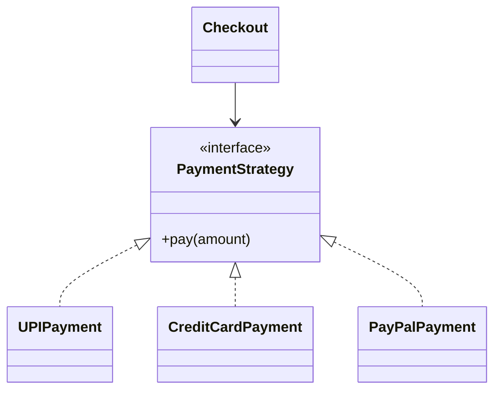

# Strategy Design Pattern

**Category:** Behavioral Design Pattern
**Difficulty:** ⭐⭐⭐☆☆ (Intermediate)
**Prerequisites:** Interfaces, Composition, Polymorphism, OOP Principles
**Used In:** Android, Payment Systems, Authentication, Navigation, Compression, Sorting Algorithms

---

# 1. 📖 Overview

The **Strategy Pattern** is a **Behavioral Design Pattern** that defines a family of algorithms, encapsulates each algorithm into a separate class, and makes them interchangeable at runtime.

Instead of embedding multiple algorithms inside one class using conditional statements, each algorithm is implemented as a separate Strategy.

The client selects the required strategy dynamically without modifying existing code.

In this project, the pattern is demonstrated using a **Payment System**, where customers can choose different payment methods such as **UPI**, **Credit Card**, or **PayPal** while using the same checkout process.

---

# 2. 🎯 Problem Statement

Imagine building an online shopping application.

Customers can pay using:

- UPI
- Credit Card
- Debit Card
- PayPal

Without the Strategy Pattern, the checkout process contains multiple conditional statements.

```text
Checkout

↓

if(UPI)

↓

UPI Payment

else if(Card)

↓

Card Payment

else if(PayPal)

↓

PayPal Payment
```

As new payment methods are added, the checkout logic becomes increasingly complex and difficult to maintain.

---

# 3. 💡 Why this Pattern?

Without Strategy

```text
Checkout

↓

if()

↓

else if()

↓

else if()

↓

Payment Logic
```

Problems

- Large conditional statements
- Difficult to extend
- Tight coupling
- Poor maintainability

---

With Strategy

```text
Checkout

↓

Payment Strategy

↓

UPI

Card

PayPal
```

The Checkout delegates payment processing to the selected strategy.

Changing the payment method requires no modification to the Checkout class.

---

# 4. 🏗️ UML Diagram



---

# 5. 👥 Participants

| Participant | Responsibility |
|-------------|----------------|
| **PaymentStrategy** | Defines the common payment interface. |
| **UPIPayment** | Implements UPI payment logic. |
| **CreditCardPayment** | Implements card payment logic. |
| **PayPalPayment** | Implements PayPal payment logic. |
| **Checkout** | Maintains the selected payment strategy and delegates payment processing. |
| **Client** | Chooses the payment strategy at runtime. |

---

# 6. 💻 Implementation Walkthrough

In this project, the **Checkout** class depends only on the `PaymentStrategy` interface.

The client selects the desired payment method.

Example

```kotlin
val strategy: PaymentStrategy = UPIPayment()

val checkout = Checkout(strategy)

checkout.pay(2500.0)
```

Later, the payment method can be changed without modifying the Checkout.

```kotlin
checkout.setPaymentStrategy(CreditCardPayment())

checkout.pay(2500.0)
```

The Checkout class never knows how the payment is processed.

Each payment method encapsulates its own algorithm.

---

# 7. 🔄 Execution Flow

```text
Application Starts

↓

User Selects Payment Method

↓

Create Strategy

↓

Assign Strategy to Checkout

↓

Checkout Calls pay()

↓

Selected Strategy Executes Payment

↓

Payment Completed
```

---

# 8. ✅ Advantages

- Eliminates conditional statements.
- Encapsulates algorithms independently.
- Easy to introduce new strategies.
- Promotes composition over inheritance.
- Supports Open/Closed Principle.
- Improves code readability and maintainability.

---

# 9. ❌ Disadvantages

- Introduces additional strategy classes.
- Client must choose the appropriate strategy.
- More objects compared to a simple implementation.

---

# 10. ✅ When to Use

Use Strategy when:

- Multiple algorithms perform the same task.
- Algorithms should be interchangeable.
- Runtime behavior should change dynamically.
- Large conditional statements exist.
- New algorithms are expected in the future.

---

# 11. 🚫 When NOT to Use

Avoid Strategy when:

- Only one algorithm exists.
- Algorithms rarely change.
- Runtime switching is unnecessary.
- The additional abstraction adds little value.

---

# 12. 🌍 Real World Examples

Common examples include:

- Online Payment Systems
- Navigation Routes
- Data Compression
- Authentication Providers
- Image Processing Filters
- Tax Calculation
- Shipping Cost Calculation

Your Payment System implementation demonstrates how different payment algorithms can be selected dynamically while keeping the checkout process unchanged.

---

# 13. 📱 Android Examples

Strategy concepts are widely used in Android.

Examples include:

- Glide Disk Cache Strategies
- Retrofit Converter Factories
- RecyclerView LayoutManagers
- Image Scaling Algorithms
- Biometric Authentication Providers
- Location Providers

Example:

```text
Image Loader

↓

Cache Strategy

↓

Memory Cache

Disk Cache

No Cache
```

Another example is selecting different authentication providers (Biometric, PIN, Pattern) while keeping the login flow the same.

---

# 14. 🎤 Interview Questions

### Beginner

- What is the Strategy Pattern?
- What problem does it solve?
- Why use Strategy instead of if-else?

### Intermediate

- Difference between Strategy and State?
- Difference between Strategy and Command?
- Why is composition preferred?

### Advanced

- How would you add a new payment method?
- How does Strategy support Open/Closed Principle?
- Can Strategy be combined with Factory Method?

---

# 15. 📖 Key Takeaways

- Strategy is a **Behavioral Design Pattern**.
- It encapsulates interchangeable algorithms into separate classes.
- Algorithms can be changed at runtime without modifying the client.
- It eliminates complex conditional statements.
- Your Payment System implementation demonstrates how different payment methods can be selected dynamically while keeping the checkout process clean, extensible, and maintainable.