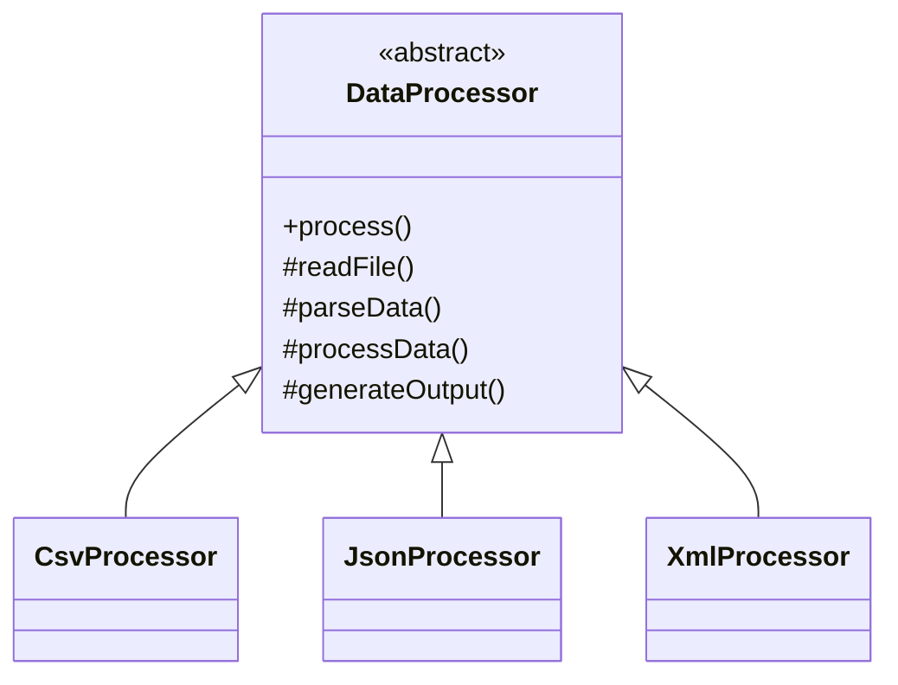

# Template Method Design Pattern

**Category:** Behavioral Design Pattern
**Difficulty:** ⭐⭐⭐☆☆ (Intermediate)
**Prerequisites:** Inheritance, Abstract Classes, Method Overriding, OOP Principles
**Used In:** Android, Spring Boot, Data Processing, Report Generation, Framework Design, ETL Pipelines

---

# 1. 📖 Overview

The **Template Method Pattern** is a **Behavioral Design Pattern** that defines the **skeleton of an algorithm** in a base class while allowing subclasses to override specific steps without changing the algorithm's overall structure.

The base class controls the execution order, ensuring consistency, while subclasses provide customized implementations for individual steps.

In this project, the pattern is demonstrated using a **Data Processing Pipeline**, where different processors (CSV, JSON, XML) execute the same workflow but implement parsing and output generation differently.

---

# 2. 🎯 Problem Statement

Imagine an application that processes multiple file formats.

Supported formats include:

- CSV
- JSON
- XML

Every processor performs the same sequence of operations.

```text
Read File

↓

Parse Data

↓

Process Data

↓

Generate Output
```

Without the Template Method Pattern, every processor duplicates the same workflow.

This results in repeated code and inconsistent execution.

---

# 3. 💡 Why this Pattern?

Without Template Method

```text
CSV Processor

↓

Read

↓

Parse

↓

Process

↓

Output

-------------------

JSON Processor

↓

Read

↓

Parse

↓

Process

↓

Output
```

Problems

- Duplicate algorithm
- Difficult maintenance
- Inconsistent workflow
- Code repetition

---

With Template Method

```text
DataProcessor

↓

process()

↓

Read File

↓

Parse Data

↓

Process Data

↓

Generate Output
```

Only the variable steps are implemented by subclasses.

The workflow remains unchanged.

---

# 4. 🏗️ UML Diagram



---

# 5. 👥 Participants

| Participant | Responsibility |
|-------------|----------------|
| **DataProcessor** | Defines the template method and common workflow. |
| **CsvProcessor** | Implements CSV-specific parsing and output. |
| **JsonProcessor** | Implements JSON-specific parsing and output. |
| **XmlProcessor** | Implements XML-specific parsing and output. |
| **Client** | Selects the processor and executes the workflow. |

---

# 6. 💻 Implementation Walkthrough

In this project, the abstract `DataProcessor` defines the complete processing workflow.

```kotlin
process()
```

Internally it performs:

```text
Read File

↓

Parse Data

↓

Process Data

↓

Generate Output
```

The steps `parseData()` and `generateOutput()` are implemented differently by each processor.

Example:

```kotlin
val processor: DataProcessor = CsvProcessor()

processor.process()
```

The client never controls individual steps.

It simply invokes the template method, and the appropriate subclass provides the customized behavior.

This guarantees that every processor follows the same execution sequence.

---

# 7. 🔄 Execution Flow

```text
Application Starts

↓

Create Processor

↓

Call process()

↓

Read File

↓

Parse Data

↓

Process Data

↓

Generate Output

↓

Complete Processing
```

---

# 8. ✅ Advantages

- Eliminates duplicate workflow logic.
- Ensures consistent execution order.
- Promotes code reuse.
- Simplifies maintenance.
- Easy to introduce new processors.
- Supports Open/Closed Principle.

---

# 9. ❌ Disadvantages

- Relies on inheritance.
- Changes to the template may affect all subclasses.
- Less flexible than composition-based approaches.

---

# 10. ✅ When to Use

Use Template Method when:

- Multiple classes share the same workflow.
- Only a few steps vary.
- Execution order must remain fixed.
- Code duplication should be minimized.

---

# 11. 🚫 When NOT to Use

Avoid Template Method when:

- Every step differs.
- Runtime algorithm switching is required.
- Composition provides a simpler solution.
- Inheritance is unnecessary.

---

# 12. 🌍 Real World Examples

Common examples include:

- File Import Systems
- Report Generation
- ETL Pipelines
- Build Systems
- Payment Processing
- Document Conversion
- Data Synchronization

Your Data Processing implementation demonstrates how different processors can share the same workflow while customizing only format-specific operations.

---

# 13. 📱 Android Examples

Template Method concepts appear in Android.

Examples include:

- Activity Lifecycle
- Fragment Lifecycle
- RecyclerView.Adapter
- AsyncTask (legacy)
- View Drawing Lifecycle

Example:

```text
Activity

↓

onCreate()

↓

onStart()

↓

onResume()

↓

onPause()

↓

onStop()

↓

onDestroy()
```

The Android framework defines the lifecycle, while developers override lifecycle callbacks to provide custom behavior.

---

# 14. 🎤 Interview Questions

### Beginner

- What is the Template Method Pattern?
- What problem does it solve?
- Why use an abstract class?

### Intermediate

- Difference between Template Method and Strategy?
- What is the Template Method?
- Why is the algorithm defined in the base class?

### Advanced

- How do hook methods work?
- How does Android Activity Lifecycle relate to Template Method?
- When should Strategy be preferred over Template Method?

---

# 15. 📖 Key Takeaways

- Template Method is a **Behavioral Design Pattern**.
- It defines the skeleton of an algorithm in a base class.
- Subclasses customize only specific steps.
- It promotes code reuse while preserving workflow consistency.
- Your Data Processing implementation demonstrates how multiple processors can follow the same execution sequence while implementing their own parsing and output generation logic.