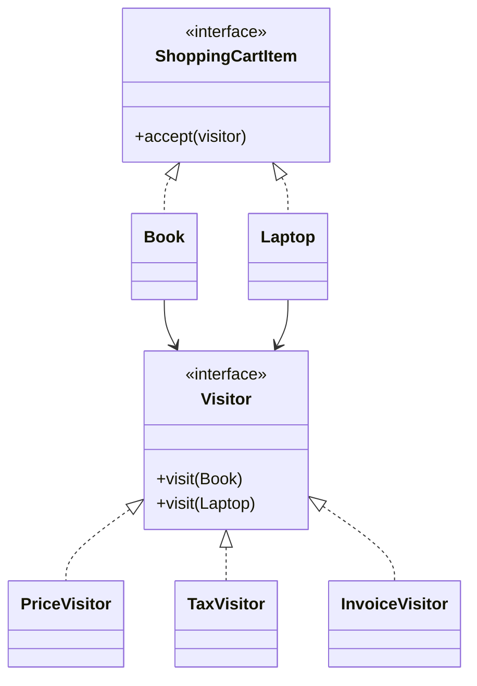

# Visitor Design Pattern

**Category:** Behavioral Design Pattern
**Difficulty:** ⭐⭐⭐⭐⭐ (Advanced)
**Prerequisites:** Interfaces, Polymorphism, Method Overloading, Double Dispatch, OOP Principles
**Used In:** Shopping Systems, Compilers, AST Processing, Reporting Systems, XML Processing, Code Analysis Tools

---

# 1. 📖 Overview

The **Visitor Pattern** is a **Behavioral Design Pattern** that allows new operations to be added to an existing object structure **without modifying the objects themselves**.

Instead of placing every operation inside the objects, the operations are moved into separate **Visitor** classes.

This enables adding new functionality while keeping the object hierarchy unchanged.

In this project, the pattern is demonstrated using a **Shopping Cart**, where different visitors perform operations such as calculating prices, applying taxes, and generating invoices.

---

# 2. 🎯 Problem Statement

Imagine an e-commerce application.

The shopping cart contains different products.

- Book
- Laptop
- Mobile
- Headphones

Today, the application calculates prices.

Tomorrow, new requirements arrive.

- Calculate Tax
- Generate Invoice
- Export Order
- Apply Discount

Without the Visitor Pattern, every product class must be modified whenever a new operation is introduced.

This violates the Open/Closed Principle.

---

# 3. 💡 Why this Pattern?

Without Visitor

```text
Book

↓

calculatePrice()

↓

calculateTax()

↓

generateInvoice()

↓

exportPDF()
```

Every new operation requires modifying every product class.

Problems

- Frequent modifications
- Violates Open/Closed Principle
- Difficult maintenance
- Business logic scattered across multiple classes

---

With Visitor

```text
Shopping Cart Item

↓

Visitor

↓

Price Visitor

Tax Visitor

Invoice Visitor
```

The object structure remains unchanged.

New operations are added simply by creating new Visitor classes.

---

# 4. 🏗️ UML Diagram



---

# 5. 👥 Participants

| Participant | Responsibility |
|-------------|----------------|
| **ShoppingCartItem** | Declares the `accept()` method. |
| **Book** | Concrete element that accepts visitors. |
| **Laptop** | Concrete element that accepts visitors. |
| **Visitor** | Declares operations for each element type. |
| **PriceVisitor** | Calculates item prices. |
| **TaxVisitor** | Calculates taxes. |
| **InvoiceVisitor** | Generates invoices. |
| **Client** | Applies visitors to shopping cart items. |

---

# 6. 💻 Implementation Walkthrough

In this project, every shopping cart item implements the `accept()` method.

Example:

```kotlin
val items = listOf(
    Book("Design Patterns", 500),
    Laptop("Gaming Laptop", 80000)
)

val visitor = PriceVisitor()

items.forEach {
    it.accept(visitor)
}
```

Internally,

```text
Book.accept()

↓

visitor.visit(Book)

--------------------

Laptop.accept()

↓

visitor.visit(Laptop)
```

This mechanism is known as **Double Dispatch**.

The correct visitor method is selected based on both:

- The Visitor type
- The Element type

This allows different operations to be added without changing the shopping cart items.

---

# 7. 🔄 Execution Flow

```text
Application Starts

↓

Create Shopping Cart

↓

Create Visitor

↓

Visit Each Item

↓

Item Accepts Visitor

↓

Visitor Executes Operation

↓

Display Result
```

---

# 8. ✅ Advantages

- Easy to add new operations.
- Keeps business logic separate from object structure.
- Promotes Open/Closed Principle.
- Improves maintainability.
- Centralizes related operations.
- Simplifies reporting and analytics.

---

# 9. ❌ Disadvantages

- Difficult to add new element types.
- Increases the number of classes.
- Double Dispatch can be difficult to understand.
- Visitor interface grows as new element types are added.

---

# 10. ✅ When to Use

Use Visitor when:

- Object structure is stable.
- New operations are added frequently.
- Business logic should remain separate.
- Reporting or analytics operations are required.

---

# 11. 🚫 When NOT to Use

Avoid Visitor when:

- New element types are added frequently.
- The object hierarchy changes often.
- The object structure is simple.
- Only one operation exists.

---

# 12. 🌍 Real World Examples

Common Visitor examples include:

- Shopping Cart Price Calculation
- Tax Calculation
- Invoice Generation
- Compiler Abstract Syntax Trees (AST)
- XML Document Processing
- File System Analysis
- Code Quality Tools

Your Shopping Cart implementation demonstrates how multiple business operations can be added without modifying product classes.

---

# 13. 📱 Android Examples

Visitor concepts are less common in Android than other patterns but still appear in:

- Android Lint
- Kotlin Compiler Plugins
- XML Layout Processing
- Navigation Graph Analysis
- Annotation Processors
- Static Code Analysis Tools

Example:

```text
AST Nodes

↓

Visitor

↓

Validation

↓

Optimization

↓

Code Generation
```

Each visitor performs a different operation while traversing the same object structure.

---

# 14. 🎤 Interview Questions

### Beginner

- What is the Visitor Pattern?
- What problem does it solve?
- Why use Visitor instead of adding methods directly?

### Intermediate

- What is Double Dispatch?
- Difference between Visitor and Strategy?
- Why is Visitor useful for reporting systems?

### Advanced

- Why is Visitor considered difficult?
- When does Visitor violate the Open/Closed Principle?
- How do compilers use the Visitor Pattern?

---

# 15. 📖 Key Takeaways

- Visitor is a **Behavioral Design Pattern**.
- It separates operations from the object structure.
- New operations can be added without modifying existing elements.
- It relies on Double Dispatch to execute the correct operation.
- Your Shopping Cart implementation demonstrates how multiple operations, such as price calculation, tax computation, and invoice generation, can be introduced while keeping product classes unchanged.