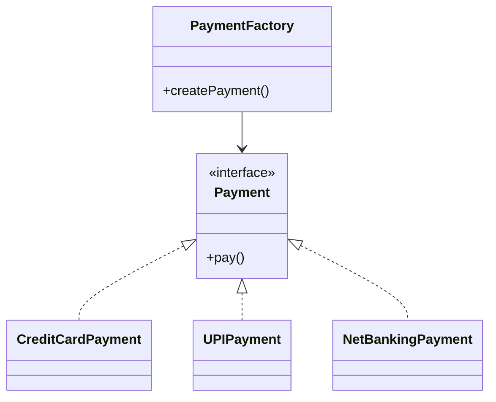

# Factory Method Design Pattern

**Category:** Creational Design Pattern
**Difficulty:** ⭐⭐☆☆☆ (Beginner - Intermediate)
**Prerequisites:** Interfaces, Polymorphism, Inheritance, OOP Principles
**Used In:** Android, Spring Boot, Payment Systems, Notification Services, Object Creation APIs

---

# 1. 📖 Overview

The **Factory Method Pattern** is a **Creational Design Pattern** that defines an interface for creating objects while allowing subclasses or concrete factories to determine which object should be instantiated.

Instead of creating objects directly using constructors, the client delegates the responsibility of object creation to a factory.

This promotes loose coupling between the client and concrete implementations.

---

# 2. 🎯 Problem Statement

Consider an application that supports multiple payment methods.

Available payment options include:

- Credit Card
- UPI
- Net Banking

Without a Factory Method, the client directly creates these objects.

```text
CreditCardPayment()

UPIPayment()

NetBankingPayment()
```

Whenever a new payment method is introduced, the client code must be modified.

This violates the **Open/Closed Principle**.

---

# 3. 💡 Why this Pattern?

Without Factory Method

```text
Client

↓

if(paymentType=="UPI")
    UPIPayment()

else if(paymentType=="CARD")
    CreditCardPayment()

else
    NetBankingPayment()
```

Problems

- Tight coupling
- Multiple if-else blocks
- Difficult to extend
- Client knows every implementation

---

With Factory Method

```text
              Client
                 │
                 ▼
         PaymentFactory
                 │
      ┌──────────┼──────────┐
      ▼          ▼          ▼
 CreditCard    UPI     NetBanking
```

The client depends only on the factory.

---

# 4. 🏗️ UML Diagram



---

# 5. 👥 Participants

| Participant | Responsibility |
|-------------|----------------|
| **Payment** | Defines the common interface for all payment methods. |
| **CreditCardPayment** | Implements card payment logic. |
| **UPIPayment** | Implements UPI payment logic. |
| **NetBankingPayment** | Implements net banking payment logic. |
| **PaymentFactory** | Creates the appropriate payment object. |
| **Client** | Requests a payment object from the factory and performs the transaction. |

---

# 6. 💻 Implementation Walkthrough

In this project, the **PaymentFactory** is responsible for creating payment objects.

The client simply requests a payment object without knowing its concrete implementation.

Example

```kotlin
val payment = PaymentFactory.createPayment(PaymentType.UPI)

payment.pay()
```

The factory determines which implementation should be returned.

The client remains completely independent of concrete payment classes.

Adding a new payment method only requires:

- Creating a new Payment implementation
- Updating the factory

The client code remains unchanged.

---

# 7. 🔄 Execution Flow

```text
Application Starts

↓

Client Selects Payment Type

↓

PaymentFactory

↓

Create Payment Object

↓

Return Payment Interface

↓

Client Calls pay()

↓

Payment Completed
```

---

# 8. ✅ Advantages

- Encapsulates object creation.
- Promotes loose coupling.
- Simplifies client code.
- Easy to extend.
- Supports Open/Closed Principle.
- Improves maintainability.
- Reduces dependency on concrete classes.

---

# 9. ❌ Disadvantages

- Adds an additional factory class.
- More classes compared to direct instantiation.
- Factory grows as more product types are added.

---

# 10. ✅ When to Use

Use Factory Method when:

- Object creation logic is complex.
- Multiple implementations exist.
- The client should remain independent of concrete classes.
- New implementations are expected in the future.
- Object creation needs to be centralized.

---

# 11. 🚫 When NOT to Use

Avoid Factory Method when:

- Only one implementation exists.
- Object creation is very simple.
- Constructors are sufficient.
- No future extension is expected.

---

# 12. 🌍 Real World Examples

- Payment Gateway Selection
- Notification Services
- Vehicle Manufacturing
- Database Driver Creation
- Document Parsers
- Cloud Storage Providers

---

# 13. 📱 Android Examples

Factory Method is widely used in Android.

Examples include:

- ViewModelProvider.Factory
- FragmentFactory
- WorkerFactory (WorkManager)
- Retrofit CallAdapter.Factory
- OkHttp Factory Classes

---

# 14. 🎤 Interview Questions

### Beginner

- What is the Factory Method Pattern?
- Why do we use Factory Method?
- What problem does it solve?

### Intermediate

- Difference between Factory Method and Abstract Factory?
- Which SOLID principle does Factory Method support?
- How does Factory Method reduce coupling?

### Advanced

- Can Factory Method return Singleton objects?
- Can Factory Method work with Dependency Injection?
- How would you extend the factory without modifying the client?

---

# 15. 📖 Key Takeaways

- Factory Method is a **Creational Design Pattern**.
- It encapsulates object creation inside a factory.
- Clients depend on abstractions instead of concrete classes.
- It improves extensibility and maintainability.
- Your implementation demonstrates how a factory can centralize object creation while keeping the client loosely coupled and easy to extend.