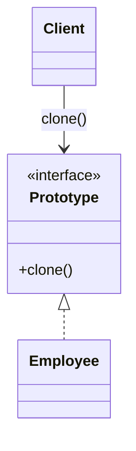

# Prototype Design Pattern

**Category:** Creational Design Pattern
**Difficulty:** ⭐⭐⭐☆☆ (Intermediate)
**Prerequisites:** Classes & Objects, Interfaces, Copy Constructors, Object Cloning, OOP Principles
**Used In:** Android, Game Development, Graphics Applications, Document Editors, Object Templates

---

# 1. 📖 Overview

The **Prototype Pattern** is a **Creational Design Pattern** that creates new objects by **copying an existing object (prototype)** instead of instantiating a new one from scratch.

Instead of repeatedly constructing identical or similar objects, the Prototype Pattern clones an existing object, making object creation faster and reducing initialization overhead.

This pattern is especially useful when object creation is expensive or when many objects share the same initial state.

---

# 2. 🎯 Problem Statement

Imagine an application that creates employee profiles.

Each employee contains:

- Name
- Department
- Designation
- Address
- Contact Details
- Skills
- Salary

Creating every employee from scratch requires setting all these properties repeatedly.

```text
Employee A

↓

Initialize Name

↓

Initialize Department

↓

Initialize Address

↓

Initialize Skills

↓

Ready
```

Repeating the same initialization for every employee is inefficient.

Instead, create one employee object and clone it whenever a similar employee is required.

---

# 3. 💡 Why this Pattern?

Without Prototype

```text
Client

↓

new Employee()

↓

Initialize Properties

↓

Repeat Again

↓

new Employee()

↓

Initialize Properties
```

Problems

- Repeated initialization
- Expensive object creation
- Duplicate code
- Poor performance

---

With Prototype

```text
Client

↓

Prototype Object

↓

clone()

↓

New Employee

↓

Modify Required Fields
```

Only the changed properties need to be updated.

---

# 4. 🏗️ UML Diagram



---

# 5. 👥 Participants

| Participant | Responsibility |
|-------------|----------------|
| **Prototype** | Declares the clone operation. |
| **Employee** | Implements cloning and creates copies of itself. |
| **Client** | Requests cloned objects instead of creating new ones. |

---

# 6. 💻 Implementation Walkthrough

In this project, the **Employee** class acts as the prototype.

Instead of creating a new Employee object every time, the client clones an existing object.

Example:

```kotlin
val originalEmployee = Employee(
    "John",
    "Engineering",
    "Android Developer"
)

val clonedEmployee = originalEmployee.clone()

clonedEmployee.name = "David"
```

The cloned object inherits all properties of the original object.

Only the required fields are modified after cloning.

This avoids repeated initialization and keeps object creation efficient.

---

# 7. 🔄 Execution Flow

```text
Application Starts

↓

Create Prototype Object

↓

Store Initial State

↓

Client Calls clone()

↓

New Object Created

↓

Modify Required Fields

↓

Use Cloned Object
```

---

# 8. ✅ Advantages

- Faster object creation.
- Reduces initialization cost.
- Eliminates repetitive object creation.
- Simplifies creation of similar objects.
- Supports runtime object duplication.
- Improves performance for expensive objects.

---

# 9. ❌ Disadvantages

- Deep cloning can be complex.
- Cloning nested objects requires additional effort.
- Circular references make cloning difficult.
- Incorrect cloning may produce shared mutable state.

---

# 10. ✅ When to Use

Use Prototype when:

- Object creation is expensive.
- Similar objects are created repeatedly.
- Runtime duplication is required.
- Initial object configuration is complex.
- Existing object should be reused as a template.

---

# 11. 🚫 When NOT to Use

Avoid Prototype when:

- Objects are simple to create.
- Deep copying is unnecessary.
- Cloning logic becomes more complex than construction.
- Every object has completely different data.

---

# 12. 🌍 Real World Examples

- Resume Templates
- Employee Records
- Game Characters
- PowerPoint Templates
- Photoshop Layers
- Document Templates
- Vehicle Configurations

Example:

Instead of creating a new resume from scratch, users duplicate an existing resume template and modify only the required information.

---

# 13. 📱 Android Examples

Prototype concepts can be seen in:

- RecyclerView ViewHolder recycling
- Copying Notification configurations
- Data class `copy()` in Kotlin
- Duplicating UI models
- Cloning configuration objects
- Bitmap copy operations

Example:

```kotlin
val updatedUser = user.copy(name = "Gagan")
```

Kotlin's `copy()` function is a practical implementation of the Prototype concept.

---

# 14. 🎤 Interview Questions

### Beginner

- What is the Prototype Pattern?
- Why do we clone objects instead of creating new ones?
- What problem does Prototype solve?

### Intermediate

- Difference between Shallow Copy and Deep Copy?
- What is expensive object creation?
- How is Prototype different from Builder?

### Advanced

- How would you implement deep cloning?
- Can Prototype be combined with Factory Method?
- What challenges arise when cloning nested objects?

---

# 15. 📖 Key Takeaways

- Prototype is a **Creational Design Pattern**.
- It creates objects by cloning existing ones.
- Reduces expensive object initialization.
- Improves performance when creating similar objects.
- Your implementation demonstrates how an existing object can be reused as a template, allowing new objects to be created efficiently with minimal changes.