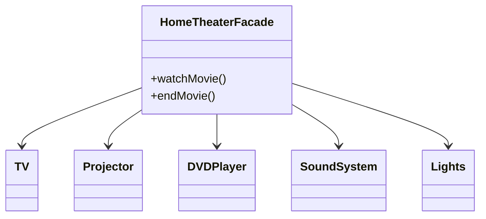

# Facade Design Pattern

**Category:** Structural Design Pattern
**Difficulty:** ⭐⭐☆☆☆ (Beginner - Intermediate)
**Prerequisites:** Classes & Objects, Composition, OOP Principles, Basic Object Collaboration
**Used In:** Android, Spring Boot, Home Automation, Enterprise Applications, SDK Design

---

# 1. 📖 Overview

The **Facade Pattern** is a **Structural Design Pattern** that provides a **simplified interface** to a complex subsystem.

Instead of allowing the client to interact with multiple classes directly, a Facade exposes a single entry point that coordinates all subsystem operations.

In this project, the pattern is demonstrated using a **Home Theater System**, where a single `HomeTheaterFacade` controls multiple devices such as the TV, DVD Player, Sound System, Lights, and Projector.

---

# 2. 🎯 Problem Statement

Imagine operating a home theater manually.

To watch a movie, the user must:

- Turn on the TV
- Turn on the Projector
- Turn on the Sound System
- Turn on the DVD Player
- Dim the Lights
- Play the Movie

Without a Facade, the client has to manage every subsystem individually.

```text
TV.turnOn()

Projector.turnOn()

SoundSystem.turnOn()

DVDPlayer.turnOn()

Lights.dim()

DVDPlayer.playMovie()
```

As the number of devices increases, the client code becomes complex and difficult to maintain.

---

# 3. 💡 Why this Pattern?

Without Facade

```text
Client

↓

TV

↓

Projector

↓

Sound System

↓

DVD Player

↓

Lights
```

Problems

- Client knows every subsystem.
- Too many object interactions.
- High coupling.
- Difficult maintenance.

---

With Facade

```text
              Client
                 │
                 ▼
        HomeTheaterFacade
      ┌─────┼─────┼─────┐
      ▼     ▼     ▼     ▼
     TV  Projector DVD  Audio
               │
             Lights
```

The client communicates with only one class.

The Facade coordinates the rest.

---

# 4. 🏗️ UML Diagram



---

# 5. 👥 Participants

| Participant | Responsibility |
|-------------|----------------|
| **HomeTheaterFacade** | Provides a simple interface to operate the entire home theater. |
| **TV** | Controls television operations. |
| **Projector** | Displays movie output. |
| **DVDPlayer** | Plays movie content. |
| **SoundSystem** | Produces audio. |
| **Lights** | Adjusts room lighting. |
| **Client** | Uses only the Facade instead of interacting with every subsystem. |

---

# 6. 💻 Implementation Walkthrough

In this project, the **HomeTheaterFacade** simplifies the interaction between multiple devices.

Instead of manually controlling every subsystem, the client simply calls:

```kotlin
val homeTheater = HomeTheaterFacade(
    tv,
    projector,
    dvdPlayer,
    soundSystem,
    lights
)

homeTheater.watchMovie()
```

Internally, the Facade performs the following operations:

- Turns on the TV
- Starts the Projector
- Powers the Sound System
- Starts the DVD Player
- Dims the Lights
- Plays the Movie

The client doesn't need to know the order or complexity of these operations.

Similarly,

```kotlin
homeTheater.endMovie()
```

shuts down every subsystem in the appropriate sequence.

---

# 7. 🔄 Execution Flow

```text
Application Starts

↓

Client Calls watchMovie()

↓

HomeTheaterFacade

↓

Turn On TV

↓

Turn On Projector

↓

Turn On Sound System

↓

Dim Lights

↓

Start DVD

↓

Movie Starts
```

---

# 8. ✅ Advantages

- Simplifies complex systems.
- Reduces coupling between client and subsystems.
- Improves code readability.
- Hides implementation details.
- Easier to maintain.
- Promotes Separation of Concerns.

---

# 9. ❌ Disadvantages

- Facade can become a "God Object" if too many responsibilities are added.
- May hide useful subsystem functionality.
- Adds an extra abstraction layer.

---

# 10. ✅ When to Use

Use Facade when:

- A subsystem is complex.
- Clients should not know subsystem details.
- Multiple objects are always used together.
- A simplified API is desirable.
- Reducing coupling is important.

---

# 11. 🚫 When NOT to Use

Avoid Facade when:

- The subsystem is already simple.
- Clients require full access to subsystem functionality.
- Hiding subsystem operations is unnecessary.
- Only one subsystem class exists.

---

# 12. 🌍 Real World Examples

- Home Theater Systems
- Banking Applications
- Travel Booking Systems
- E-commerce Checkout
- Hospital Management Systems
- Smart Home Controllers

Your Home Theater example clearly demonstrates how a single interface can simplify interaction with multiple independent devices.

---

# 13. 📱 Android Examples

Facade is commonly used in Android.

Examples include:

- Repository Pattern
- CameraX API
- Glide
- Picasso
- Coil
- WorkManager
- Navigation Component

Example:

```kotlin
repository.getUser()
```

Internally, the Repository may:

- Call Retrofit
- Query Room Database
- Check Cache
- Merge Results

The ViewModel interacts only with the Repository, which acts as a Facade.

---

# 14. 🎤 Interview Questions

### Beginner

- What is the Facade Pattern?
- What problem does Facade solve?
- Why do we need a Facade?

### Intermediate

- Difference between Facade and Adapter?
- Difference between Facade and Proxy?
- How does Facade reduce coupling?

### Advanced

- Can multiple Facades exist for the same subsystem?
- How does Repository resemble the Facade Pattern?
- What are the risks of creating a large Facade?

---

# 15. 📖 Key Takeaways

- Facade is a **Structural Design Pattern**.
- It provides a simple interface to a complex subsystem.
- It hides implementation details from the client.
- It reduces coupling and improves maintainability.
- Your Home Theater implementation demonstrates how multiple independent devices can be coordinated through a single Facade, allowing the client to perform complex operations with just one method call.