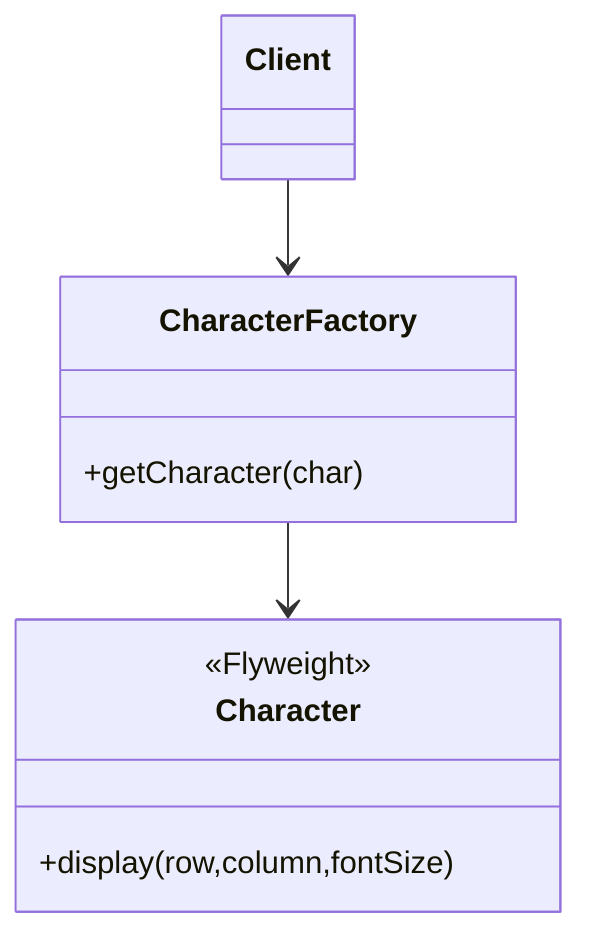

# Flyweight Design Pattern

**Category:** Structural Design Pattern
**Difficulty:** ⭐⭐⭐⭐☆ (Advanced)
**Prerequisites:** Object Sharing, Composition, Memory Management, OOP Principles
**Used In:** Text Editors, Game Development, Android UI Rendering, Graphics Engines, Caching

---

# 1. 📖 Overview

The **Flyweight Pattern** is a **Structural Design Pattern** that minimizes memory usage by sharing common objects instead of creating multiple identical instances.

Rather than storing duplicate information in every object, the Flyweight Pattern separates an object's state into:

- **Intrinsic State** (Shared)
- **Extrinsic State** (Provided by the client)

This significantly reduces memory consumption when dealing with a large number of similar objects.

In this project, the pattern is demonstrated using a **Text Editor**, where character objects are shared while properties such as row, column, and font size are supplied externally.

---

# 2. 🎯 Problem Statement

Imagine building a text editor.

A document contains

```text
HELLO WORLD
```

Without Flyweight,

each character creates a separate object.

```text
H

E

L

L

O

...

Thousands of Character Objects
```

Many of these characters are identical.

Creating a new object for every repeated character wastes memory.

---

# 3. 💡 Why this Pattern?

Without Flyweight

```text
Client

↓

Character(H)

↓

Character(H)

↓

Character(H)

↓

Character(H)
```

Problems

- Huge memory consumption
- Duplicate objects
- Poor scalability
- Expensive object creation

---

With Flyweight

```text
Client

↓

Character Factory

↓

Shared Character(H)

↓

Different Positions
```

One object is reused many times.

Only position and formatting information change.

---

# 4. 🏗️ UML Diagram



---

# 5. 👥 Participants

| Participant | Responsibility |
|-------------|----------------|
| **Character** | Flyweight object containing shared (intrinsic) state. |
| **CharacterFactory** | Creates and manages shared Character objects. |
| **Client** | Supplies extrinsic state such as row, column, or font size. |

---

# 6. 💻 Implementation Walkthrough

In this project, each alphabet character acts as a Flyweight object.

Instead of creating multiple instances of the same character, the **CharacterFactory** checks whether the object already exists.

Example

```kotlin
val h1 = factory.getCharacter('H')

val h2 = factory.getCharacter('H')
```

Both variables reference the same object.

When displaying the character,

the client provides the varying information.

```kotlin
h1.display(1,1,14)

h2.display(5,8,20)
```

Shared State

- Character

External State

- Row
- Column
- Font Size

This dramatically reduces memory usage.

---

# 7. 🔄 Execution Flow

```text
Application Starts

↓

Client Requests Character

↓

CharacterFactory

↓

Character Exists?

↓

Yes

↓

Return Existing Object

↓

Client Supplies Position

↓

Display Character
```

---

# 8. ✅ Advantages

- Reduces memory consumption.
- Eliminates duplicate objects.
- Improves application performance.
- Supports large-scale object creation.
- Centralizes shared object management.
- Scales efficiently for graphics-heavy applications.

---

# 9. ❌ Disadvantages

- More complex design.
- Requires separating intrinsic and extrinsic state.
- Shared objects must remain immutable.
- Increased coordination between factory and client.

---

# 10. ✅ When to Use

Use Flyweight when:

- Large numbers of similar objects exist.
- Memory optimization is important.
- Object creation is expensive.
- Objects contain significant shared state.
- Performance is critical.

---

# 11. 🚫 When NOT to Use

Avoid Flyweight when:

- Few objects exist.
- Objects are mostly unique.
- Memory usage is not a concern.
- Separating shared and external state adds unnecessary complexity.

---

# 12. 🌍 Real World Examples

- Text Editors
- Chess Games
- Game Characters
- Tree Rendering
- Particle Systems
- Icon Libraries
- Map Markers

Your Character example demonstrates how identical letters are reused while position and formatting are provided separately.

---

# 13. 📱 Android Examples

Flyweight concepts are common in Android.

Examples include:

- RecyclerView ViewHolder reuse
- Bitmap caching
- Typeface caching
- Drawable caching
- Emoji rendering
- Resource management

A good example is **RecyclerView**, where ViewHolders are reused instead of creating a new view for every item.

---

# 14. 🎤 Interview Questions

### Beginner

- What is the Flyweight Pattern?
- What problem does Flyweight solve?
- What is object sharing?

### Intermediate

- What is intrinsic state?
- What is extrinsic state?
- Why is immutability important?

### Advanced

- How does Flyweight reduce memory?
- Difference between Flyweight and Singleton?
- How does RecyclerView relate to Flyweight?

---

# 15. 📖 Key Takeaways

- Flyweight is a **Structural Design Pattern**.
- It minimizes memory usage by sharing objects.
- Shared data is stored as intrinsic state.
- Variable data is supplied as extrinsic state.
- Your Character and CharacterFactory implementation demonstrates how identical objects can be reused efficiently while keeping object-specific information outside the shared object.