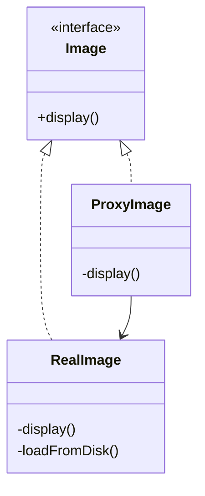

# Proxy Design Pattern

**Category:** Structural Design Pattern
**Difficulty:** ⭐⭐⭐☆☆ (Intermediate)
**Prerequisites:** Interfaces, Composition, Lazy Initialization, OOP Principles
**Used In:** Android, Spring Boot, Security, ORM Frameworks, Image Loading, Remote Services

---

# 1. 📖 Overview

The **Proxy Pattern** is a **Structural Design Pattern** that provides a **placeholder or surrogate** for another object to control access to it.

Instead of allowing the client to communicate directly with the real object, the client communicates with the Proxy.

The Proxy decides:

- When to create the real object.
- Whether access should be granted.
- Whether additional operations such as logging, caching, authentication, or lazy loading should be performed.

In this project, the pattern is demonstrated using an **Image Viewer**, where a `ProxyImage` delays loading the actual image until it is needed.

---

# 2. 🎯 Problem Statement

Imagine an image gallery application.

Each image is very large.

Loading every image during application startup would consume:

- Memory
- CPU
- Network bandwidth
- Startup time

Example

```text
Image 1 (20 MB)

Image 2 (30 MB)

Image 3 (50 MB)

Image 4 (40 MB)
```

Most users may open only one image.

Loading every image immediately is wasteful.

---

# 3. 💡 Why this Pattern?

Without Proxy

```text
Client

↓

RealImage

↓

Load Image

↓

Display Image
```

Every image loads immediately.

Problems

- Slow startup
- High memory usage
- Poor performance
- Unnecessary resource consumption

---

With Proxy

```text
Client

↓

ProxyImage

↓

Is Image Loaded?

↓

No

↓

Create RealImage

↓

Display Image
```

The image is loaded only when required.

---

# 4. 🏗️ UML Diagram



---

# 5. 👥 Participants

| Participant | Responsibility |
|-------------|----------------|
| **Image** | Common interface used by both RealImage and ProxyImage. |
| **RealImage** | Loads and displays the actual image. |
| **ProxyImage** | Controls access to the RealImage and performs lazy initialization. |
| **Client** | Works only with the Image interface. |

---

# 6. 💻 Implementation Walkthrough

In this project, the client interacts with the **Image** interface.

Instead of creating a `RealImage` directly, it creates a `ProxyImage`.

Example

```kotlin
val image: Image = ProxyImage("design-patterns.png")

image.display()
```

When `display()` is called for the first time:

- Proxy checks whether the image has already been loaded.
- If not, it creates the `RealImage`.
- The image is loaded from disk.
- The image is displayed.

Subsequent calls simply reuse the existing `RealImage`.

```text
First Call

↓

Load Image

↓

Display

-------------------

Second Call

↓

Display Only
```

This avoids repeated loading and improves performance.

---

# 7. 🔄 Execution Flow

```text
Application Starts

↓

Client Creates ProxyImage

↓

Client Calls display()

↓

Proxy Checks RealImage

↓

RealImage Exists?

↓

No

↓

Create RealImage

↓

Load Image

↓

Display Image

↓

Next Request

↓

Reuse Existing Image
```

---

# 8. ✅ Advantages

- Supports lazy initialization.
- Improves application performance.
- Reduces memory usage.
- Adds security and access control.
- Enables caching.
- Keeps client code simple.
- Supports Open/Closed Principle.

---

# 9. ❌ Disadvantages

- Adds an additional abstraction layer.
- Slightly increases complexity.
- More classes to maintain.
- May introduce a small performance overhead.

---

# 10. ✅ When to Use

Use Proxy when:

- Objects are expensive to create.
- Lazy loading is required.
- Access control is needed.
- Remote object communication is involved.
- Logging or caching should be added transparently.

---

# 11. 🚫 When NOT to Use

Avoid Proxy when:

- The real object is lightweight.
- Immediate object creation is acceptable.
- No additional control is required.
- Simplicity is preferred.

---

# 12. 🌍 Real World Examples

Common Proxy examples include:

- Image Viewer
- ATM Card
- Credit Card
- API Gateway
- Reverse Proxy
- Database Proxy
- Remote Service Proxy
- Security Proxy

Your Image Viewer example demonstrates how expensive resources can be loaded only when they are actually required.

---

# 13. 📱 Android Examples

Proxy concepts appear frequently in Android.

Examples include:

- Glide
- Picasso
- Coil
- Room Lazy Loading
- Retrofit Dynamic Proxies
- Hilt Lazy Injection

Example:

```kotlin
Glide.with(context)
    .load(url)
    .into(imageView)
```

Glide does not immediately load every image. It performs lazy loading, caching, and efficient resource management behind the scenes.

Another example is:

```kotlin
val repository by lazy {
    UserRepository()
}
```

The repository object is created only when it is first accessed.

---

# 14. 🎤 Interview Questions

### Beginner

- What is the Proxy Pattern?
- What problem does Proxy solve?
- Why do we use lazy loading?

### Intermediate

- Difference between Proxy and Decorator?
- Difference between Proxy and Adapter?
- What types of Proxy exist?

### Advanced

- How does Hibernate Lazy Loading use Proxy?
- How do Retrofit Dynamic Proxies work?
- How would you implement a Remote Proxy?

---

# 15. 📖 Key Takeaways

- Proxy is a **Structural Design Pattern**.
- It provides a surrogate object to control access to another object.
- It supports lazy initialization, security, caching, and logging.
- It improves performance by delaying expensive object creation.
- Your ProxyImage implementation demonstrates how a lightweight proxy can control access to a RealImage, ensuring the image is loaded only when it is actually needed.